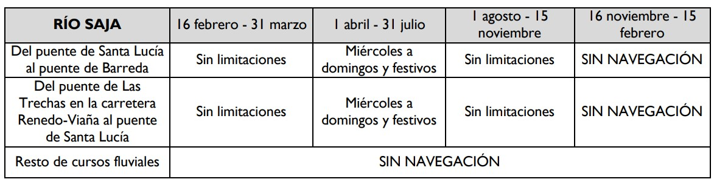
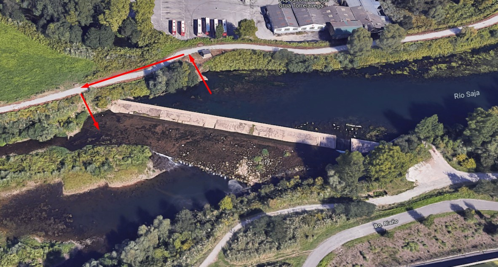

# CHC - Río Saja
[:earth_americas: *Seguridad y seguimiento - Mapa de Garmin InReach* :earth_americas:](https://share.garmin.com/gpalacios82)

## Índice
* [Río Saja de Torrelavega a su Desembocadura](./CHC-Saja.md#río-saja-en-torrelavega)
* [Río Saja En el Puente de las Trechas](./CHC-Saja.md#río-saja-en-el-puente-de-las-trechas)

## Río Saja en Torrelavega

> Revisar si es navegable, en la última actualización de la CHC, este tramo era navegable sólo hasta el Puente de Barreda [43.363349,-4.048187](https://maps.app.goo.gl/WoR3oiQRJSGXN6VM9)

**Datos Generales:**
* **Cuenca:** CHC
* **Río:** Saja
* **Sector:** Desde Torrelavega a su desembocadura
* **Dificultad:** Pendiente
* **Estación y Caudal:** [1240 - Río Saja en Torrelavega](https://visor.saichcantabrico.es/)
* **Tiempo total (aprox):** 5:00 (4:00 acortado)

>**Observaciones:**
*Habrá que observar el río para evaluar si hay nivel suficiente. Cuidado con la estación de aforo, habrá que esquivarla*

**Tabla de riesgos**
| Peligro | Evacuación | Suma | Categorización |
|---------|------------|------|----------------|
|    x    |     x      |   x  |   Pendiente    |

**Waypoints:**
* **PID :arrow_lower_right::** [43.355851,-4.059678](https://maps.app.goo.gl/gdPm3TkRxPG1piNh9) :car: [Waze a PID](https://waze.com/?ll=43.355851,-4.059678&navigate=yes)
* **PID alternativo :arrow_lower_right::** [43.377409,-4.047008](https://maps.app.goo.gl/yyHak9qt4zAj3yAF7) :car: [Waze a PID](https://waze.com/?ll=43.377409,-4.047008&navigate=yes)
* **PSC :arrow_upper_right::** [43.433841,-4.039856](https://maps.app.goo.gl/x1LJqr3k7kYBZHnQ8) :car: [Waze a PSC](https://waze.com/?ll=43.433841,-4.039856&navigate=yes)

**Tracks:**
* [Track Raft - 13 Km](https://connect.garmin.com/modern/course/263074652)
* [Track Walk - 11 Km](https://connect.garmin.com/modern/course/263074264)
* [Track Walk Acortado - 7,5 Km](https://connect.garmin.com/modern/course/289134936)

**Historial**
* N/A

## Río Saja en el Puente de las Trechas

**Datos Generales:**
* **Cuenca:** CHC
* **Río:** Saja
* **Sector:** Desde El Puente de las Trechas hasta el Puente de Barreda
* **Dificultad:** Pendiente
* **Estación y Caudal:** [1242 - Río Saja en Azud Puente de San Miguel](https://visor.saichcantabrico.es/)
* **Tiempo total (aprox):** 7:00

>**Observaciones:**
*En el PK 9,5 hay un azud, esquivar por la derecha, y justo después hay zona de piedras, cuidado con el nivel de agua que haya, ya que es una sección que dura 1 km.
Seguidamente en el PK 11 está la cascada de Camarao, que habrá que bajarse para evitarla
En el PK 13,1 hay otro obstáculo en el que habrá que desmontarse, y en el 14,8 otro*

**Tabla de riesgos**
| Peligro | Evacuación | Suma | Categorización |
|---------|------------|------|----------------|
|    x    |     x      |   x  |   Pendiente    |

**Waypoints:**
* **PID :arrow_lower_right::** [43.321717,-4.192352](https://maps.app.goo.gl/roJRTVVS8tkV2K298) :car: [Waze a PID](https://waze.com/?ll=43.321717,-4.192352&navigate=yes)
* **PSC :arrow_upper_right::** [43.363349,-4.048187](https://maps.app.goo.gl/XLT31CkRMG9ps1By5) :car: [Waze a PSC](https://waze.com/?ll=43.363349,-4.048187&navigate=yes)
* **PSC alternativo (PK 9) :arrow_upper_right::** [43.365793,-4.141507](https://maps.app.goo.gl/pgeYijKzSQeGsamP9) :car: [Waze a PSC](https://waze.com/?ll=43.365793,-4.141507&navigate=yes)

**Tracks:**
* [Track Raft - 18 Km](https://connect.garmin.com/modern/course/263471589)
* [Track Walk - 15 Km](https://connect.garmin.com/modern/course/263469697)

**Historial**
* N/A

## Aviso importante
>*La información de este sitio sobre secciones de aguas bravas se basa en las experiencias y valoraciones de este sitio web. No pretende ser una guía profesional ni una recomendación absoluta. **El usuario es el único responsable de conocer sus limitaciones y evaluar los riesgos** antes de realizar cualquier actividad en el río. Las condiciones del río cambian constantemente y la información aquí podría no ser completamente precisa en el momento de su viaje. **Considere este sitio como un registro personal, no como una guía general de navegación en aguas bravas**. Este sitio queda exento de cualquier responsabilidad por daños o lesiones derivados del uso de esta información. Siempre consulte con guías profesionales y tome todas las medidas de seguridad necesarias antes de adentrarse en el río.*