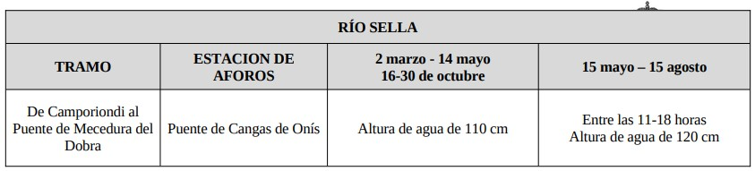
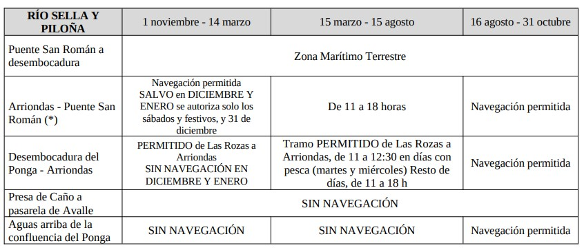

# CHC - Río Sella
[:earth_americas: *Seguridad y seguimiento - Mapa de Garmin InReach* :earth_americas:](https://share.garmin.com/gpalacios82)

## Índice
* [Río Sella](./CHC-Sella.md#chc---río-sella) :heavy_check_mark:

## Río Sella

**Datos Generales:**
* **Cuenca:** CHC
* **Río:** Sella
* **Sector:** Desde Orriondas a Santianes
* **Dificultad:** Clase I
* **Estación y Caudal:** [1292 Río Sella En Arriondas](https://visor.saichcantabrico.es/)
* **Tiempo total (aprox):** 6:00

>**Observaciones:**
*Mejor fuera de época estival, por encontrar algo menos de gente y encontrar más caudal
Se puede empezar un poco más arriba [Camporriondi - 43.250982,-5.107726](https://maps.app.goo.gl/U1df4XyHZR95h3TG8)
 [43.307181,-5.131318](https://maps.app.goo.gl/GkJtTtuddXUuvWH56)*

**Tabla de riesgos**
| Peligro | Evacuación | Suma | Categorización |
|---------|------------|------|----------------|
|    0    |     0      |   0  |   Bajo         |

**Waypoints:**
* **PID :arrow_lower_right::** [43.393027,-5.180817](https://maps.app.goo.gl/cg6vS8r3UfxUZvQN6) :car: [Waze a PID](https://waze.com/?ll=43.393027,-5.180817&navigate=yes)
* **PSC :arrow_upper_right::** [43.431699,-5.063255](https://maps.app.goo.gl/C8wZ6hynpiEhUEs2A) :car: [Waze a PSC](https://waze.com/?ll=43.431699,-5.063255&navigate=yes)

**Tracks:**
* [Track Raft - 15 Km](https://connect.garmin.com/modern/course/263743690)
* [Track Walk - 13 Km](https://connect.garmin.com/modern/course/263744764)

**Historial**
* [20290829 - Con empresa de turismo activo](https://connect.garmin.com/modern/activity/5457046017)

## Aviso importante
>*La información de este sitio sobre secciones de aguas bravas se basa en las experiencias y valoraciones de este sitio web. No pretende ser una guía profesional ni una recomendación absoluta. **El usuario es el único responsable de conocer sus limitaciones y evaluar los riesgos** antes de realizar cualquier actividad en el río. Las condiciones del río cambian constantemente y la información aquí podría no ser completamente precisa en el momento de su viaje. **Considere este sitio como un registro personal, no como una guía general de navegación en aguas bravas**. Este sitio queda exento de cualquier responsabilidad por daños o lesiones derivados del uso de esta información. Siempre consulte con guías profesionales y tome todas las medidas de seguridad necesarias antes de adentrarse en el río.*