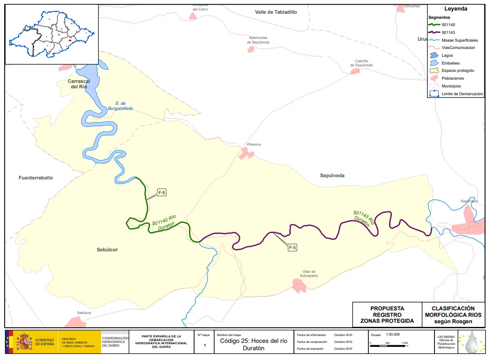

# CHD - Duratón
[:earth_americas: *Seguridad y seguimiento - Mapa de Garmin InReach* :earth_americas:](https://share.garmin.com/gpalacios82)

**Es todo zona protegida, se necesita permiso de medio ambiente**

*Es todo zona protegida, se necesita permiso de medio ambiente. Además hay limitación de navegación entre la Ermita de San Frutos y la bóbeda de la presa de Burgomillodo entre el 1 de enero y el 31 de julio por cria de aves (Buitre Leonado). Esta ruta queda fuera de dicha zona*

## Índice
* [Río Duratón desde el Puente de Villaseca](./CHD-Duraton.md#río-duratón-desde-el-puente-de-villaseca)
* [Río Duratón desde Burgomillodo hasta San Miguel de Bernuy](./CHD-Duraton.md#río-duratón-desde-burgomillodo-hasta-san-miguel-de-bernuy)

## Río Duratón desde el Puente de Villaseca

**Datos Generales:**
* **Cuenca:** CHD
* **Río:** Duratón
* **Sector:** Desde el Puente de Villaseca al Embalse de Burgomillodo
* **Dificultad:** G-I/II
* **Estación y Caudal:** [EA012 - Duratón en Sepúlveda](https://www.saihduero.es/risr/EA012)
* **Tiempo total (aprox):** 3:00

**Tabla de riesgos**
| Peligro | Evacuación | Suma | Categorización |
|---------|------------|------|----------------|
|    x    |     x      |   x  |   Pendiente    |

**Waypoints:**
* **PID :arrow_lower_right::** [41.293343,-3.843757](https://maps.app.goo.gl/hN2zrVQtpRoeggfC6) :car: [Waze a PID](https://waze.com/?ll=41.293343,-3.843757&navigate=yes)
* **PSC :arrow_upper_right::** [41.313174,-3.878785](https://maps.app.goo.gl/4XggUTaRQmpGB2Py7) :car: [Waze a PSC](https://waze.com/?ll=41.313174,-3.878785&navigate=yes)

**Tracks:**
* [Track Raft - 7,8 Km](https://connect.garmin.com/modern/course/130324061)
* [Track Walk - 5,5 Km](https://connect.garmin.com/modern/course/262529052)

**Historial**
* N/A

## Río Duratón desde Burgomillodo hasta San Miguel de Bernuy

**Datos Generales:**
* **Cuenca:** CHD
* **Río:** Duratón
* **Sector:** Desde Burgomillodo
* **Dificultad:** Pendiente
* **Estaciones y Caudales:** 
    * [EA012 - Duratón en Sepúlveda](https://www.saihduero.es/risr/EA012)
    * [EA012 - Duratón en Salida del embalse de Las Vencías](https://www.saihduero.es/risr/EA161)
* **Tiempo total (aprox):** 5:00

>**Observaciones:**
*Ningúna estación sirve como referencia, ya que una está antes del embalse de Burgomillodo, y el otro después del embalse de las Vencías. Por lo que dependerá del caudal de suelta del embalse de Burgomillodo. Todo el año tiene caudal eso sí.
Es una zona del rio con más bien poco caudal, habrá que bajarse bastantes veces. Lo bueno es que tiene poco desnivel. Entre la presa y Carrascal del Río, los niños remontan el río para capturar cangrejos de río.*

**Tabla de riesgos**
| Peligro | Evacuación | Suma | Categorización |
|---------|------------|------|----------------|
|    x    |     X      |   x  |   Pendiente    |

**Waypoints:**
* **PID :arrow_lower_right::** [41.339037,-3.886910](https://maps.app.goo.gl/bkdvbSF11tiHVSyK9) :car: [Waze a PID](https://waze.com/?ll=41.339037,-3.886910&navigate=yes)
* **PSC :arrow_upper_right::** [41.396472,-3.953428](https://maps.app.goo.gl/u4QagSynDJoNFADr9) :car: [Waze a PSC](https://waze.com/?ll=41.396472,-3.953428&navigate=yes)

**Tracks:**
* [Track Raft - 12 Km](https://connect.garmin.com/modern/course/263056749)
* [Track Walk - 11 Km](https://connect.garmin.com/modern/course/263056101)

**Historial**
* N/A

## Aviso importante
>*La información de este sitio sobre secciones de aguas bravas se basa en las experiencias y valoraciones de este sitio web. No pretende ser una guía profesional ni una recomendación absoluta. **El usuario es el único responsable de conocer sus limitaciones y evaluar los riesgos** antes de realizar cualquier actividad en el río. Las condiciones del río cambian constantemente y la información aquí podría no ser completamente precisa en el momento de su viaje. **Considere este sitio como un registro personal, no como una guía general de navegación en aguas bravas**. Este sitio queda exento de cualquier responsabilidad por daños o lesiones derivados del uso de esta información. Siempre consulte con guías profesionales y tome todas las medidas de seguridad necesarias antes de adentrarse en el río.*