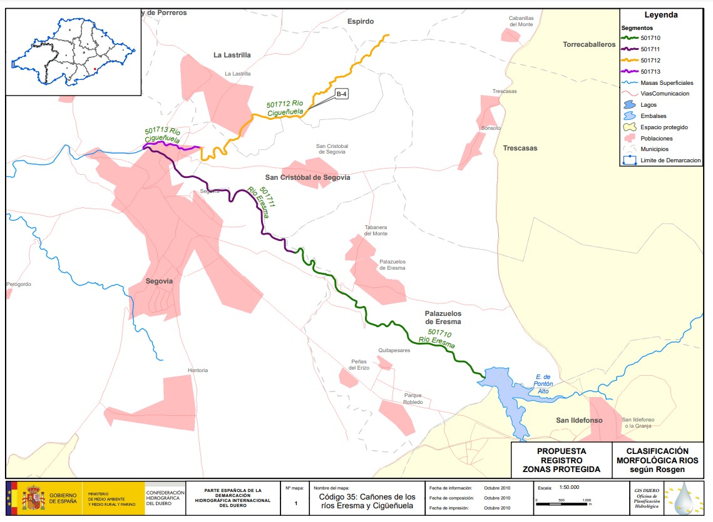

# CHD - Eresma
[:earth_americas: *Seguridad y seguimiento - Mapa de Garmin InReach* :earth_americas:](https://share.garmin.com/gpalacios82)

## Índice
* [Río Eresma desde el Pontón Alto - Pendiente](./CHD-Eresma.md#río-eresma-desde-el-pontón-alto)

## Río Eresma desde el Pontón Alto

**Datos Generales:**
* **Cuenca:** CHD
* **Río:** Eresma
* **Sector:** Ponton Alto - Segovia
* **Dificultad:** Pendiente
* **Estación y Caudal:** 
    * Caudal de Inicio del río: [EA526 - Eresma en Salida del embalse de El Pontón Alto](https://www.saihduero.es/risr/EA526)
    * Caudal Final del río: [EA050 - Eresma en Segovia](https://www.saihduero.es/risr/EA050)
* **Fuente:** N/A
* **Tiempo total (aprox):** 6:00

>**Observaciones:**
>*En la parte alta del trayecto, se hace la competicion de slalom de aguas bravas en primavera*
>
>*Antes del paso por el Dyc hay una cancela en medio del río, y luego una caida de agua a la altura del Dyc*
>
>*Despues en la zona de las arenas hay varios azudes donde hay que salir del rio y algún salto de agua*
>
>*En la zona de la alameda del Parral el agua es más tranquila, pero sigue habiendo algo de corriente y algún azud*
>
>*Antes del Pontón Alto, es zona protegida y restringida por ser Reserva de la Biosfera y zona ZEPA del PN Guadarrama*

20241020: Se ha procedido a explorar con 0,29m3/s y se ha determinado que no es suficiente caudal, pero tambien creo que con más de 1m3, se puede complicar debido al fuerte desnivel desde el PID al PSC

[Mapa con las fotos trackeadas de las exploraciones](https://www.google.com/maps/d/edit?mid=1aHs-sK1hTiQmO2kKOP1mVDceQ_boCxY&usp=sharing)

**Tabla de riesgos**
| Peligro | Evacuación | Suma | Categorización |
|---------|------------|------|----------------|
|    x    |     x      |   x  |   Pendiente    |

**Waypoints:**
* **PID :arrow_lower_right::** [40.915851,-4.038375](https://maps.app.goo.gl/3CiWw9ih6cKoehgq9) :car: [Waze a PID](https://waze.com/?ll=40.915851,-4.038375&navigate=yes)
* **PSC :arrow_upper_right::** [40.954468,-4.134710](https://maps.app.goo.gl/oHib5MzmZS9RCLzM6) :car: [Waze a PSC](https://waze.com/?ll=40.954468,-4.134710&navigate=yes)

**Tracks:**
* [Track Raft - 11,5 Km](https://connect.garmin.com/modern/course/314648803)
* [Track Walk - 12 Km](https://connect.garmin.com/modern/course/314647767)

**Historial**
* N/A

## Aviso importante
>*La información de este sitio sobre secciones de aguas bravas se basa en las experiencias y valoraciones de este sitio web. No pretende ser una guía profesional ni una recomendación absoluta. **El usuario es el único responsable de conocer sus limitaciones y evaluar los riesgos** antes de realizar cualquier actividad en el río. Las condiciones del río cambian constantemente y la información aquí podría no ser completamente precisa en el momento de su viaje. **Considere este sitio como un registro personal, no como una guía general de navegación en aguas bravas**. Este sitio queda exento de cualquier responsabilidad por daños o lesiones derivados del uso de esta información. Siempre consulte con guías profesionales y tome todas las medidas de seguridad necesarias antes de adentrarse en el río.*