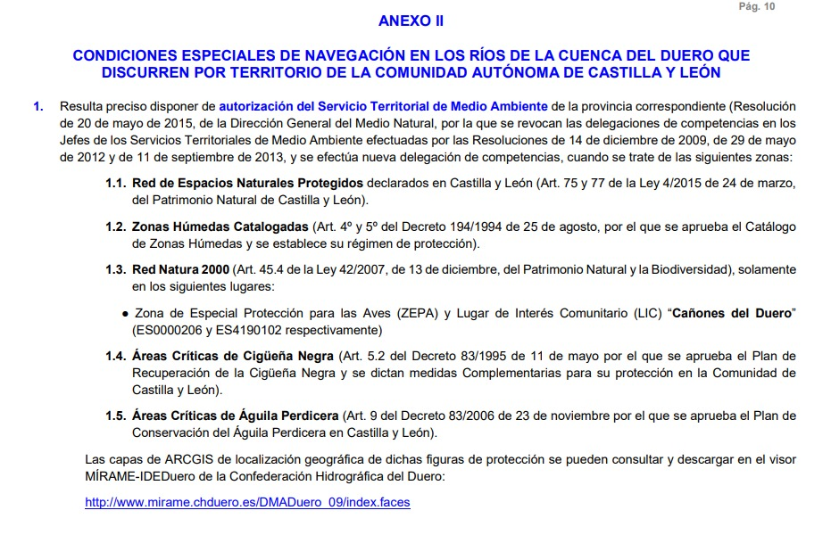

# Cuenca hidrográfica del Duero
[:earth_americas: *Seguridad y seguimiento - Mapa de Garmin InReach* :earth_americas:](https://share.garmin.com/gpalacios82)

* [Río Duratón](./CHD-Duraton.md)
* [Río Eresma](./CHD-Eresma.md)

## Permiso de Navegación Responsable
Para embarcaciones a remo de **menos de 2,5m de eslora**, no es necesario el permiso de navegación responsable, ya que se considera un objeto de baño. Si que es necesario cumplir con la normativa de la CHD. Y si no se obtiene el permiso de navegación responsable, **se debe navegar únicamente en zonas en las que está permitido el baño**.

## Normativa de Protección Medioambiental

[URL de Mirame CHD que funciona](https://mirame.chduero.es/chduero/viewer)

## Aviso importante
>*La información de este sitio sobre secciones de aguas bravas se basa en las experiencias y valoraciones de este sitio web. No pretende ser una guía profesional ni una recomendación absoluta. **El usuario es el único responsable de conocer sus limitaciones y evaluar los riesgos** antes de realizar cualquier actividad en el río. Las condiciones del río cambian constantemente y la información aquí podría no ser completamente precisa en el momento de su viaje. **Considere este sitio como un registro personal, no como una guía general de navegación en aguas bravas**. Este sitio queda exento de cualquier responsabilidad por daños o lesiones derivados del uso de esta información. Siempre consulte con guías profesionales y tome todas las medidas de seguridad necesarias antes de adentrarse en el río.*