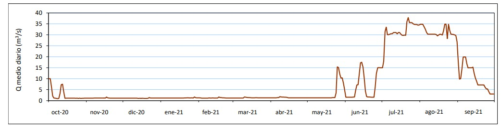

# CHE - Ebro
[:earth_americas: *Seguridad y seguimiento - Mapa de Garmin InReach* :earth_americas:](https://share.garmin.com/gpalacios82)

## Índice
* [S1 - Río Ebro](./CHE-Ebro.md#río-ebro-s1)
* [S2 - Río Ebro](./CHE-Ebro.md#río-ebro-s2)
* [S3 - Río Ebro](./CHE-Ebro.md#río-ebro-s3)
* [S4 - Río Ebro](./CHE-Ebro.md#río-ebro-s4)

El alto Ebro se hace en junio/julio, cuando hay sueltas del embalse del Ebro, el resto del año a penas hay caudal

## Río Ebro S1

>**Datos Generales:**
* **Cuenca:** CHE
* **Río:** Ebro
* **Sector:** 1
* **Dificultad:** G-II/III
* **Estación y Caudal:** [A059 - Ebro en Arroyo](http://www.saihebro.com/semobile/index.php?url=/tr/ficha/estacion:A026)
* **Fuente:** [Wikiloc - Daniel_Afonso](https://www.wikiloc.com/kayaking-canoeing-trails/ebro-dia-1-105629500)
* **Tiempo total (aprox):** Pendiente

>**Observaciones:**
*Pendiente*

**Tabla de riesgos**
| Peligro | Evacuación | Suma | Categorización |
|---------|------------|------|----------------|
|    x    |     x      |   x  |   Pendiente    |

>**Waypoints:**
* **PID :arrow_lower_right::** [XXXXX](XXXX) :car: [Waze a PID](https://waze.com/?ll=LATITUD,LONGITUD&navigate=yes)
* **PSC :arrow_upper_right::** [XXXXX](XXXX) :car: [Waze a PSC](https://waze.com/?ll=LATITUD,LONGITUD&navigate=yes)

>**Tracks:**
* [Track Raft - xx Km](XXX)
* [Track Walk - xx Km](XXX)

>**Historial**
* N/A

## Río Ebro S2

>**Datos Generales:**
* **Cuenca:** CHE
* **Río:** Ebro
* **Sector:** 2
* **Dificultad:** G-II
* **Estación y Caudal:** [A059 - Ebro en Arroyo](http://www.saihebro.com/semobile/index.php?url=/tr/ficha/estacion:A026)
* **Fuente:** [Wikiloc - Daniel_Afonso](https://www.wikiloc.com/kayaking-canoeing-trails/ebro-dia-2-aroco-sobrepena-105707019)
* **Tiempo total (aprox):** Pendiente

>**Observaciones:**
*A fecha 17/06/2022: muchos pasos bloqueados por árboles caídos*

**Tabla de riesgos**
| Peligro | Evacuación | Suma | Categorización |
|---------|------------|------|----------------|
|    x    |     x      |   x  |   Pendiente    |

>**Waypoints:**
* **PID :arrow_lower_right::** [XXXXX](XXXX) :car: [Waze a PID](https://waze.com/?ll=LATITUD,LONGITUD&navigate=yes)
* **PSC :arrow_upper_right::** [XXXXX](XXXX) :car: [Waze a PSC](https://waze.com/?ll=LATITUD,LONGITUD&navigate=yes)

>**Tracks:**
* [Track Raft - xx Km](XXX)
* [Track Walk - xx Km](XXX)

>**Historial**
* N/A

## Río Ebro S3

>**Datos Generales:**
* **Cuenca:** CHE
* **Río:** Ebro
* **Sector:** 3
* **Dificultad:** G-II
* **Estación y Caudal:** [A059 - Ebro en Arroyo](http://www.saihebro.com/semobile/index.php?url=/tr/ficha/estacion:A026)
* **Fuente:** [Wikiloc - Daniel_Afonso](https://www.wikiloc.com/kayaking-canoeing-trails/rio-ebro-rebollar-de-ebro-escalada-105809810)
* **Tiempo total (aprox):** Pendiente

>**Observaciones:**
*A fecha 18/06/2022: Algunos árboles caídos y piscinas largas en la primera mitad del recorrido. Segunda mitad más interesante y despejada*

**Tabla de riesgos**
| Peligro | Evacuación | Suma | Categorización |
|---------|------------|------|----------------|
|    x    |     x      |   x  |   Pendiente    |

>**Waypoints:**
* **PID :arrow_lower_right::** [XXXXX](XXXX) :car: [Waze a PID](https://waze.com/?ll=LATITUD,LONGITUD&navigate=yes)
* **PSC :arrow_upper_right::** [XXXXX](XXXX) :car: [Waze a PSC](https://waze.com/?ll=LATITUD,LONGITUD&navigate=yes)

>**Tracks:**
* [Track Raft - xx Km](XXX)
* [Track Walk - xx Km](XXX)

>**Historial**
* N/A

## Río Ebro S4

>**Datos Generales:**
* **Cuenca:** CHE
* **Río:** Ebro
* **Sector:** 4
* **Dificultad:** G-III(4)
* **Estación y Caudal:** [A059 - Ebro en Arroyo](http://www.saihebro.com/semobile/index.php?url=/tr/ficha/estacion:A026)
* **Fuente:** [Wikiloc - Daniel_Afonso](https://www.wikiloc.com/kayaking-canoeing-trails/rio-ebro-escalada-villanueva-rampalay-105873123)
* **Tiempo total (aprox):** Pendiente

>**Observaciones:**
*A fecha 19/06/2022: Aguas bravas clase III (4) en la primera mitad y clase II en la segunda mitad.
Desde Pesquera de Ebro más fácil (clase II)*

**Tabla de riesgos**
| Peligro | Evacuación | Suma | Categorización |
|---------|------------|------|----------------|
|    x    |     x      |   x  |   Pendiente    |

>**Waypoints:**
* **PID :arrow_lower_right::** [XXXXX](XXXX) :car: [Waze a PID](https://waze.com/?ll=LATITUD,LONGITUD&navigate=yes)
* **PSC :arrow_upper_right::** [XXXXX](XXXX) :car: [Waze a PSC](https://waze.com/?ll=LATITUD,LONGITUD&navigate=yes)

>**Tracks:**
* [Track Raft - xx Km](XXX)
* [Track Walk - xx Km](XXX)

>**Historial**
* N/A

## Aviso importante
>*La información de este sitio sobre secciones de aguas bravas se basa en las experiencias y valoraciones de este sitio web. No pretende ser una guía profesional ni una recomendación absoluta. **El usuario es el único responsable de conocer sus limitaciones y evaluar los riesgos** antes de realizar cualquier actividad en el río. Las condiciones del río cambian constantemente y la información aquí podría no ser completamente precisa en el momento de su viaje. **Considere este sitio como un registro personal, no como una guía general de navegación en aguas bravas**. Este sitio queda exento de cualquier responsabilidad por daños o lesiones derivados del uso de esta información. Siempre consulte con guías profesionales y tome todas las medidas de seguridad necesarias antes de adentrarse en el río.*