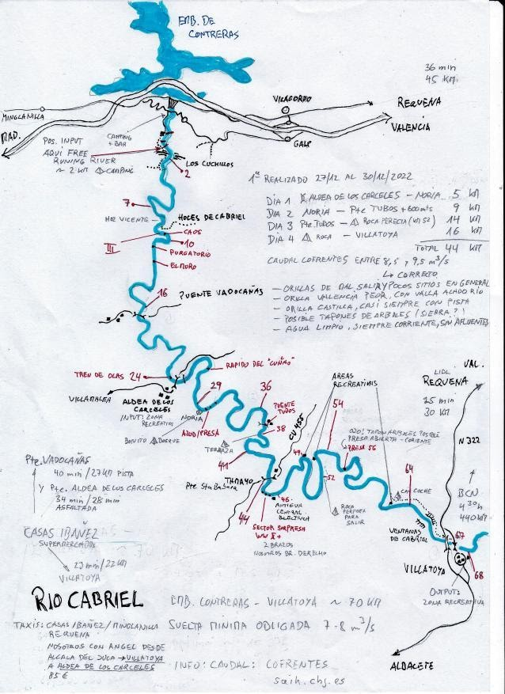
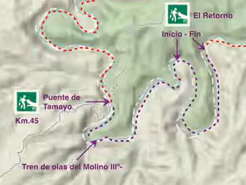

# CHJ - Cabriel
[:earth_americas: *Seguridad y seguimiento - Mapa de Garmin InReach* :earth_americas:](https://share.garmin.com/gpalacios82)

**Fuente:** [Topología del Cabriel en Youtube](https://www.youtube.com/watch?v=e7pmjRh3XRc)

## Índice
* [Hoces del Cabriel hasta Villatoya](CHJ-Cabriel.md#hoces-del-cabriel-hasta-villatoya)
* [Río Cabriel Tamayo y Tete](CHJ-Cabriel.md#río-cabriel-tamayo-y-tete) :heavy_check_mark:
* [Río Cabriel Tamayo](CHJ-Cabriel.md#río-cabriel-tamayo) :heavy_check_mark:
* [Río Cabriel Tete](CHJ-Cabriel.md#río-cabriel-tete) :heavy_check_mark:

## El río ofrece dos versiones:

### Caudal de invierno
*De mediados de septiembre a mayo*

El caudal de invierno se caracteriza por tener menos caudal. Es cuando la presa de Contreras se encuentra cerrada recogiendo los excedentes y almacenando agua. La suelta se reduce al mínimo ecológico, apenas  1 metro cubico por segundo.  A partir del [tramo de las Hoces (puente de Vadocañas)](https://maps.app.goo.gl/Pkd8ut2qx6rxXu1GA) el río Cabriel ya vuelve a recoger caudal suficiente para la navegación. Esto se debe a la gran cantidad de surgencias, fuentes, manantiales, ramblas y alguna otra fuga que tiene el propio pantano.

El agua no está fría y espectacularmente limpia.

### Caudal de verano
*Desde mayo a mediados de septiembre*

Caudal de verano o presa suelta: El río se convierte en un río más potente donde según las necesidades hídricas el caudal puede variar desde los 7,5 metros cúbicos hasta los 25 metros cúbicos por segundo. Como hemos mencionado anteriormente las fechas de sueltas varían.

El río está más bravo y más emocionante. No hay que remar tanto, pero el agua esta fría debido a que el agua que sale por la presa sale de la parte de abajo donde no le da el sol.

## Hoces del Cabriel hasta Villatoya

>**Datos Generales:**
* **Cuenca:** CHJ
* **Río:** Cabriel
* **Sector:** Hoces del Cabriel, Tamayo, Tete y Villatoya
* **Dificultad:** G-III
* **Estación y Caudal:** [EA130 - Contreras: 5-20m3](https://saih.chj.es/chj/saih/estacionform?id=344&t=a)
* **Tiempo total (aprox):** 3 días

>**Observaciones:**
>
>La **expedición en packraft por el río Cabriel** se plantea como una **travesía de tres días**, combinando un **remonte en bicicleta** con e-bike de **42 km y 851 m de desnivel** el **primer día**, seguido de **tres etapas de navegación**, progresivamente más largas. 
>
>La ruta comienza con un **día exigente**, en el que la **bicicleta servirá como medio de acceso al punto de embarque**, reduciendo el tiempo de ascenso gracias al remolque con e-bike. **El primer tramo en packraft (18 km) es técnico y requiere scouting previo**, finalizando en **Poza y Playa de Vadocañas**, donde se montará el primer campamento. 
>
>El **segundo día cubre 28 km de navegación**, con una distribución equilibrada para gestionar la fatiga, permitiendo explorar y disfrutar del paisaje antes de llegar al **área recreativa del Puente de Tamayo**. 
>
>El **tercer día** se recorren los **últimos 25 km del río**, con un tramo final que asegura una llegada a tiempo para **desmontar equipo y regresar en coche a casa sin prisas**. 
>
>La planificación considera **ritmos sostenibles, pausas estratégicas y scouting en puntos clave**, asegurando una expedición **autosuficiente, fluida y bien estructurada**, para maximizar la experiencia sin comprometer la **seguridad ni la gestión del esfuerzo**.
>
>En **invierno y principios de primavera**, la presa de **Contreras permanece cerrada**, reduciendo el caudal del río Cabriel al **mínimo ecológico de 1 m³/s**, lo que puede hacer **inviable la navegación en los primeros tramos** debido a la falta de profundidad y la necesidad de porteos frecuentes. Sin embargo, **a partir del Puente de Vadocañas**, el río **recupera caudal** gracias a **surgencias y manantiales**, permitiendo una navegación más fluida. Para la expedición, será clave **monitorizar el caudal en tiempo real**, y si se mantiene bajo, considerar **iniciar la ruta desde Vadocañas** para evitar tramos secos o excesivamente técnicos por falta de agua.

| Día      | Actividad                         | Inicio | Fin   | Distancia | Tiempo estimado  |
|----------|-----------------------------------|--------|-------|-----------|------------------|
| **Viernes**  | 🚴 **Bici** (42 km, 851 m D+)      | 07:30  | 12:30 | 42 km     | 5-5.5 h          |
|          | 🛶 **Packraft** (18 km)           | 13:30  | 17:30 | 18 km     | 4 h              |
|          | 🏕️ **Campamento en Vadocañas**     | 18:00  | 19:00 | -         | Cena y descanso  |
| **Sábado**   | 🛶 **Packraft** (28 km)           | 08:00  | 16:30 | 28 km     | 8.5 h            |
|          | 🏕️ **Campamento en Tamayo**        | 17:00  | 19:00 | -         | Cena y descanso  |
| **Domingo**  | 🛶 **Packraft** (25 km)           | 08:00  | 15:30 | 25 km     | 7.5 h            |
|          | 🚗 **Regreso en coche**            | 16:30  | 20:00 | -         | 3.5-4 h          |

**Peligros y puntos críticos en el descenso del Cabriel**

*Basado en la información recopilada, el **descenso del río Cabriel** presenta varios puntos críticos donde hay que extremar la precaución debido a **sifones, drosajes y obstáculos naturales**. A continuación, se detallan los principales riesgos y la mejor estrategia para evitarlos:*

* **Paso del Caos** (39.480668, -1.505772): Presencia de **sifón peligroso en el MD** causado por la caída de dos pinos. Se recomienda tomar el ramal izquierdo con precaución.
* **El Purgatorio** (39.477273, -1.505879): **Sifón localizado en el MD** al final del rápido. Mantenerse en la izquierda del paso para evitar riesgos.
* **El Paredón** (39.475590, -1.510370): **Drosaje fuerte en la base de la pared izquierda**. La corriente tiende a arrastrar hacia esa zona; navegar pegado a la derecha para evitar atrapamientos.

>**Waypoints:**
* **PID :arrow_lower_right::** [39.536729,-1.503341](https://maps.app.goo.gl/MCRdDzqMn9ketyab6) :car: [Waze a PID](https://waze.com/?ll=39.536729,-1.503341&navigate=yes)
* **PSC :arrow_upper_right::** [39.336075,-1.339609](https://maps.app.goo.gl/GbG2jRhk36p3jLxeA) :car: [Waze a PSC](https://waze.com/?ll=39.336075,-1.339609&navigate=yes)

>**Otros Waypoints de interés:**

**Puntos de Inicio:**
* PLAN A: Punto de inicio del packraft y almacenamiento de bicicletas (100m más arriba de la Presa de Miraflores): 39.536679, -1.503330
* PLAN B: Punto de inicio del packraft y almacenamiento de bicicletas (Puente de Vadocañas): 39.444955, -1.522883

**Puntos de interés o puntos delicados:**
* Tobogán de la presa de Miraflores: 39.534859, -1.501176
* Ola de Contreras: 39.530319, -1.505704
* Barranco de la huerta de Mateo (puede aumentar el caudal en caso de lluvias): 39.482664, -1.512179
* Rápido del Caos (Clase III): 39.480668, -1.505772
* Rápido del Purgatorio (Clase III): 39.477273, -1.505879
* Rápido del Muro o Paredón (Clase III): 39.475590, -1.510370
* Presa tras el Tete: 39.372182, -1.406241 

**Vías de escape:**
* PK06 - Vía de escape antes de las Hoces y los rápidos clase III: 39.498185, -1.499841
* PK09 - Segunda vía de escape antes de las Hoces y los rápidos de clase III: 39.486523,-1.505529
* PK18 - Puente de Vadocañas: 39.444955, -1.522883
* PK26 - Aldea los Cárceles: 39.415109,-1.499595
* PK28 - Salida a camino antes de rápido “El Cuñao”: 39.422810,-1.483567
* PK46 - Puente de Tamayo: 39.369670, -1.448199
* PK47 - Estación hidroeléctrica la Terrera: 39.361442,-1.449088
* PK51 - Embarcadero antes de la Hoz del Tete: 39.377226,-1.430231
* PK55 - Area recreativa Hoz del Tete: 39.378299,-1.424793
* PK70 - Parking de Villaltoya (Albacete): 39.335723,-1.339216

**Zonas de acapada:**
* Zona de acampada (Puente de Vadocañas): 39.444955, -1.522883
* Zona de acampada (Área Recreativa de Tamayo): 39.369670, -1.448199
* PLAN B: Zona de acampada (100m más abajo del Parking de Villaltoya, Albacete): 39.335723,-1.339216

**Puntos de Fin:**
* PLAN A: Punto de Fin y estacionamiento del vehículo en Villaltoya (Albacete): 39.335947, -1.339617
* PLAN B: Punto de Fin y estacionamiento del vehículo en Cofrentes (Valencia): 39.229907,-1.069316

>**Tracks:**
* [Track Raft Dia 1 - 18 Km - Pendiente 0,41%](https://connect.garmin.com/modern/course/331766339)
* [Track Raft Dia 2 - 28 Km - Pendiente 0,23%](https://connect.garmin.com/modern/course/331766453)
* [Track Raft Dia 3 - 24 Km - Pendiente 0,21%](https://connect.garmin.com/modern/course/331767250)
* [Track Raft - Plan B - 24 Km - Pendiente 0,18%](https://connect.garmin.com/modern/course/331894273)

* [Track BTT - 42 Km](https://connect.garmin.com/modern/course/331766153)
* [Track BTT - Plan B - 67 Km](https://connect.garmin.com/modern/course/331892604)

>**Historial**
* N/A

## Río Cabriel Tamayo y Tete

>**Datos Generales:**
* **Cuenca:** CHJ
* **Río:** Cabriel
* **Sector:** Tamayo y Tete
* **Dificultad:** G-II(3)
* **Estación y Caudal:** [EA130 - Contreras: 5-20m3](https://saih.chj.es/chj/saih/estacionform?id=344&t=a)
* **Tiempo total (aprox):** 7:30

>**Observaciones:**
*El río cambia radicalmente entre hacerlo con 7 o con 14m3. Por ejemplo, con 7m3, recuerdo caidas de agua tipo azud, que se habian convertido en trenes de olas con 14m3. De hecho es más divertido este tramo con 7 que con 14, ya que el rio tiene más gracia. Con 14 es todo agua rápida y trenes de olas*

>**Waypoints:**
* **PID :arrow_lower_right::** [39.371443,-1.449603](https://maps.app.goo.gl/gyorUtGE9u5uP97j6) :car: [Waze a PID](https://waze.com/?ll=39.371443,-1.449603&navigate=yes)
* **PSC :arrow_upper_right::** [39.379198,-1.425302](https://maps.app.goo.gl/c3n44kZUPzGqwqPk9) :car: [Waze a PSC](https://waze.com/?ll=39.379198,-1.425302&navigate=yes)

>**Tracks:**
* [Track Raft - 9 Km](https://connect.garmin.com/modern/course/187820557)
* [Track Walk - 5 Km](https://connect.garmin.com/modern/course/127111055)

>**Historial**
* [20240907 - 12,13m3/s](https://connect.garmin.com/modern/activity/16970708702/1)
* [20240907 - 12,27m3/s](https://connect.garmin.com/modern/activity/16973531327/1)

## Río Cabriel Tamayo

>**Datos Generales:**
* **Cuenca:** CHJ
* **Río:** Cabriel
* **Sector:** Tamayo
* **Dificultad:** G-II(3)
* **Estación y Caudal:** [EA130 - Contreras: 5-20m3](https://saih.chj.es/chj/saih/estacionform?id=344&t=a)
* **Tiempo total (aprox):** 7:00

>**Waypoints:**
* **PID :arrow_lower_right::** [39.371443,-1.449603](https://maps.app.goo.gl/gyorUtGE9u5uP97j6) :car: [Waze a PID](https://waze.com/?ll=39.371443,-1.449603&navigate=yes)
* **PSC :arrow_upper_right::** [39.377321,-1.430226](https://maps.app.goo.gl/wZcu9q4gMF6po2cQ8) :car: [Waze a PSC](https://waze.com/?ll=39.377321,-1.430226&navigate=yes)

>**Tracks:**
* [Track Raft - 7 Km](https://connect.garmin.com/modern/course/125878441)
* [Track Walk - 5,5 Km](https://connect.garmin.com/modern/course/260097420)

>**Historial**
* [20240907 - 12,13m3/s](https://connect.garmin.com/modern/activity/16970708702/1)
* [20240907 - 12,27m3/s](https://connect.garmin.com/modern/activity/16973531327/1)

## Río Cabriel Tete

>**Datos Generales:**
* **Cuenca:** CHJ
* **Río:** Cabriel
* **Sector:** Tete
* **Dificultad:** G-I(2)
* **Estación y Caudal:** [EA130 - Contreras: 5-20m3](https://saih.chj.es/chj/saih/estacionform?id=344&t=a)
* **Tiempo total (aprox):** 5:30

>**Waypoints:**
* **PID :arrow_lower_right::** [39.377321,-1.430226](https://maps.app.goo.gl/wZcu9q4gMF6po2cQ8) :car: [Waze a PID](https://waze.com/?ll=39.377321,-1.430226&navigate=yes)
* **PSC :arrow_upper_right::** [39.379198,-1.425302](https://maps.app.goo.gl/c3n44kZUPzGqwqPk9) :car: [Waze a PSC](https://waze.com/?ll=39.379198,-1.425302&navigate=yes)

>**Tracks:**
* [Track Raft - 5 Km](https://connect.garmin.com/modern/course/127110253)
* [Track Walk - 1 Km](https://connect.garmin.com/modern/course/260097250)

>**Historial**
* [20220828 - 6,53m3/s](https://connect.garmin.com/modern/activity/9495001222)
* [20240906 - 12,7m3/s](https://connect.garmin.com/modern/activity/16963988558/3)
* [20240907 - 12,13m3/s](https://connect.garmin.com/modern/activity/16970708702/1)
* [20240907 - 12,27m3/s](https://connect.garmin.com/modern/activity/16973531327/1)

## Aviso importante
>*La información de este sitio sobre secciones de aguas bravas se basa en las experiencias y valoraciones de este sitio web. No pretende ser una guía profesional ni una recomendación absoluta. **El usuario es el único responsable de conocer sus limitaciones y evaluar los riesgos** antes de realizar cualquier actividad en el río. Las condiciones del río cambian constantemente y la información aquí podría no ser completamente precisa en el momento de su viaje. **Considere este sitio como un registro personal, no como una guía general de navegación en aguas bravas**. Este sitio queda exento de cualquier responsabilidad por daños o lesiones derivados del uso de esta información. Siempre consulte con guías profesionales y tome todas las medidas de seguridad necesarias antes de adentrarse en el río.*