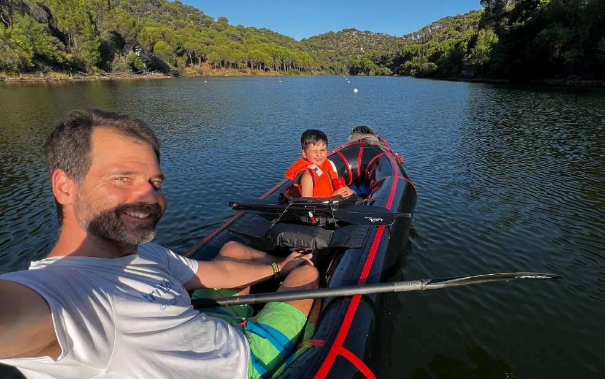

# CHT - Alberche
[:earth_americas: *Seguridad y seguimiento - Mapa de Garmin InReach* :earth_americas:](https://share.garmin.com/gpalacios82)

## Índice
* [Río Alberche en Presa de Cazalegas S8](./CHT-Alberche.md#río-alberche-en-presa-de-cazalegas-s8)
* [Río Alberche en el Embalse de Picadas](./CHT-Alberche.md#río-alberche-en-el-embalse-de-picadas) :heavy_check_mark:

## Río Alberche en Presa de Cazalegas S8

**Datos Generales:**
* **Cuenca:** CHT
* **Río:** Alberche
* **Sector:** 8
* **Dificultad:** G-I(II)
* **Estaciones y Caudales:** [AR21 - Alberche en Navaluenga: 45-70m3 (o más)](https://saihtajo.chtajo.es/stmobile/index.php?url=/tr/ficha/estacion:AR21)
* **Fuente:** Libro SUP - Embalses y ríos (p 364)
* **Tiempo total (aprox):** 7:00

>**Observaciones:**
*Tiene corriente constante. Los primeros 5,3 kms son comodos, luego se atraviesan varios viaductos y puentes, con anchuras de cauce de hasta 100m*

**Tabla de riesgos (alternativo)**
| Peligro | Evacuación | Suma | Categorización |
|---------|------------|------|----------------|
|    0    |     1      |   1  |   Bajo    |

**Waypoints:**
* **PID :arrow_lower_right::** [40.011893,-4.710301](https://maps.app.goo.gl/AhDtNjJrkpXowwtE9) :car: [Waze a PID](https://waze.com/?ll=40.011893,-4.710301&navigate=yes)
* **PSC :arrow_upper_right::** [39.964941,-4.774061](https://maps.app.goo.gl/Jbc9AFMQEoU3xxo47) :car: [Waze a PSC](https://waze.com/?ll=39.964941,-4.774061&navigate=yes)

**Tracks:**
* [Track Raft - 8,5 Km](https://connect.garmin.com/modern/course/314355320)
* [Track Walk - 9,5 Km](https://connect.garmin.com/modern/course/314354837)

**Historial**
* N/A

## Río Alberche en el Embalse de Picadas

**Datos Generales:**
* **Cuenca:** CHT
* **Río:** Embalse de Picadas (Río Alberche)
* **Sector:** Picadas
* **Dificultad:** G-0
* **Estación y Caudal:** [E20](https://saihtajo.chtajo.es/stmobile/index.php?url=/tr/ficha/estacion:E_20)
* **Fuente:** Libro SUP - Embalses y ríos (p 156)
* **Tiempo total (aprox):** 5:00

>**Observaciones:**
*Tiene lo cómodo de un embalse, y lo bonito de un río*

**Tabla de riesgos**
| Peligro | Evacuación | Suma | Categorización |
|---------|------------|------|----------------|
|     0   |       1    |   1  |      Bajo      |

**Waypoints:**
* **PID/PSC:** [40.367985,-4.304214](https://maps.app.goo.gl/bQ1y4CQ3naBfBZrVA) :car: [Waze a PID/PSC](https://waze.com/?ll=40.367985,-4.304214&navigate=yes)
* **PID/PSC Alternativo (4x4):** [40.353379,-4.281761](https://maps.app.goo.gl/AMtc3cdfJxoPwkuk9conn) :car: [Waze a PID/PSC](https://waze.com/?ll=40.353379,-4.281761&navigate=yes)

**Tracks:**
* [Track Raft - 15 Km](https://connect.garmin.com/modern/course/75805824)

**Historial**
* [20200711](https://connect.garmin.com/modern/activity/5219682527)
* [20210918](https://connect.garmin.com/modern/activity/7508791685)
* [20220822](https://connect.garmin.com/modern/activity/9455663030)
* [20240716 - 91,52%](https://connect.garmin.com/modern/activity/16445341207)

## Aviso importante
>*La información de este sitio sobre secciones de aguas bravas se basa en las experiencias y valoraciones de este sitio web. No pretende ser una guía profesional ni una recomendación absoluta. **El usuario es el único responsable de conocer sus limitaciones y evaluar los riesgos** antes de realizar cualquier actividad en el río. Las condiciones del río cambian constantemente y la información aquí podría no ser completamente precisa en el momento de su viaje. **Considere este sitio como un registro personal, no como una guía general de navegación en aguas bravas**. Este sitio queda exento de cualquier responsabilidad por daños o lesiones derivados del uso de esta información. Siempre consulte con guías profesionales y tome todas las medidas de seguridad necesarias antes de adentrarse en el río.*