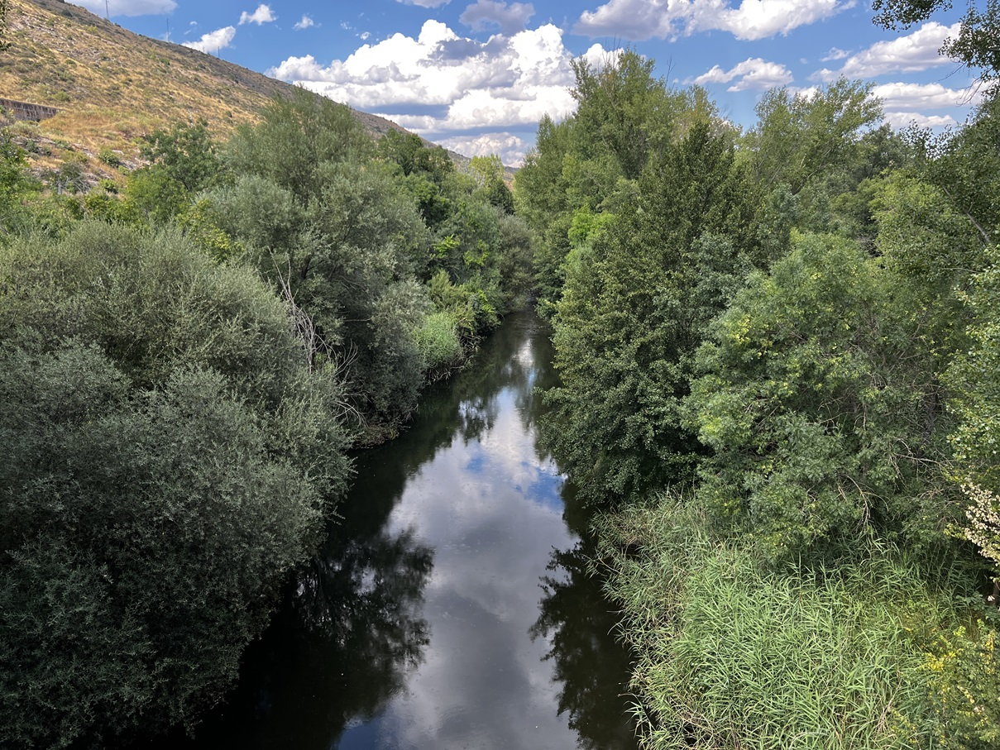
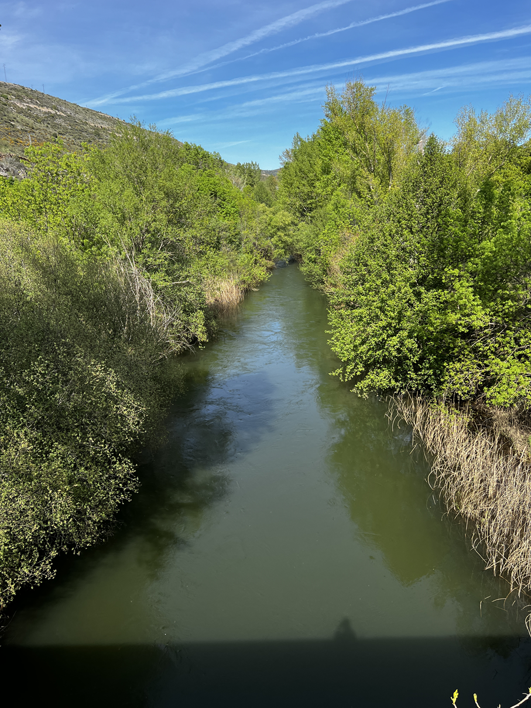
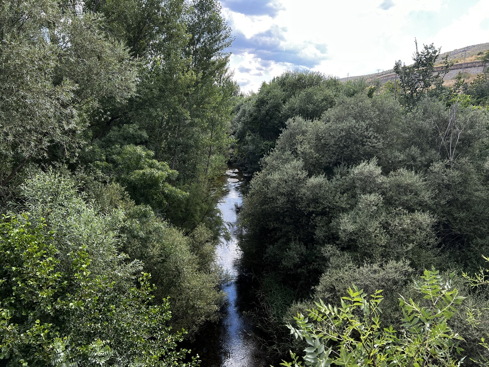
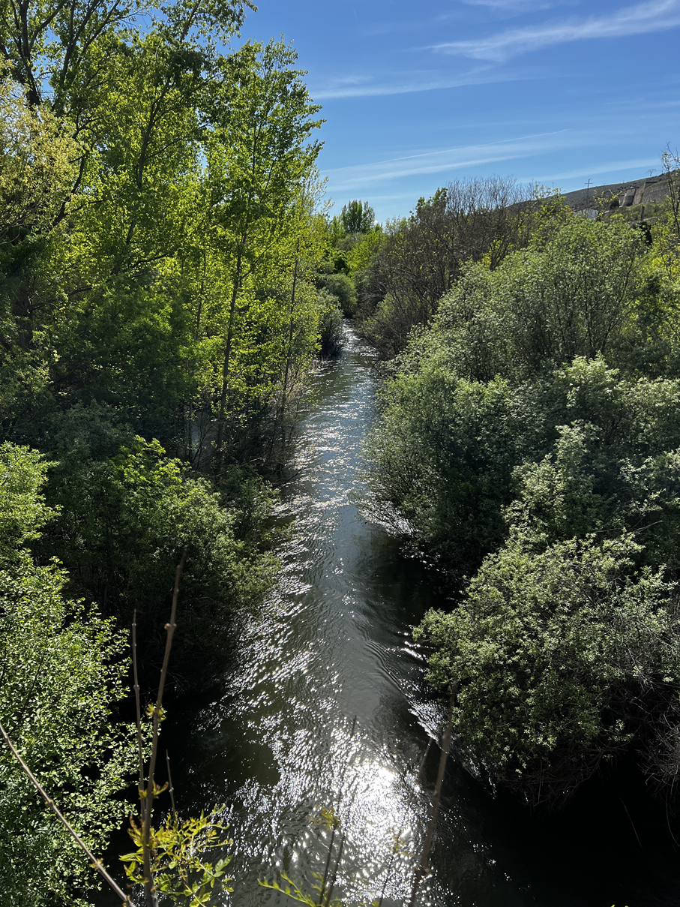
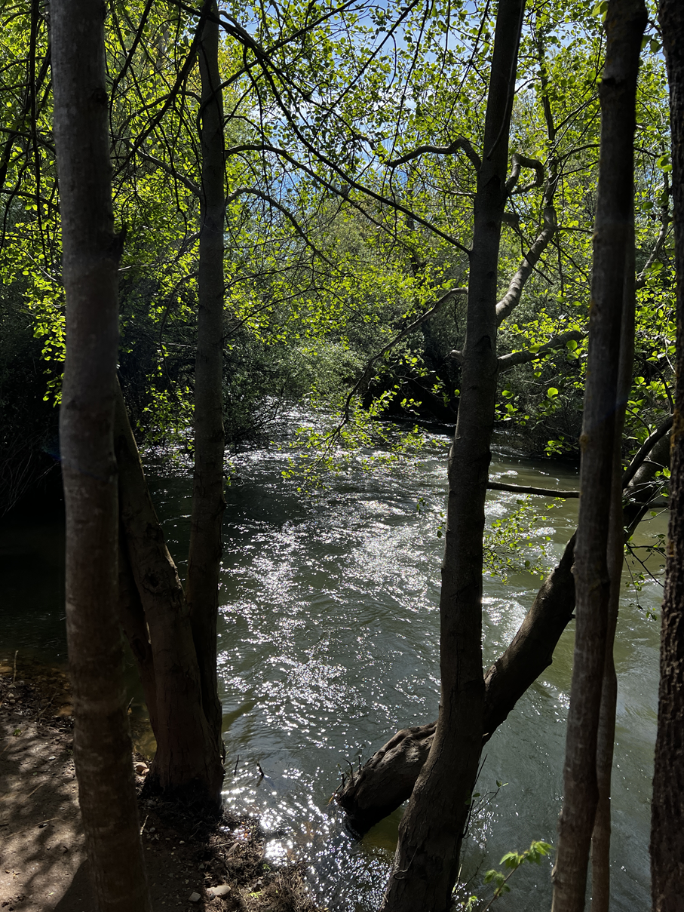
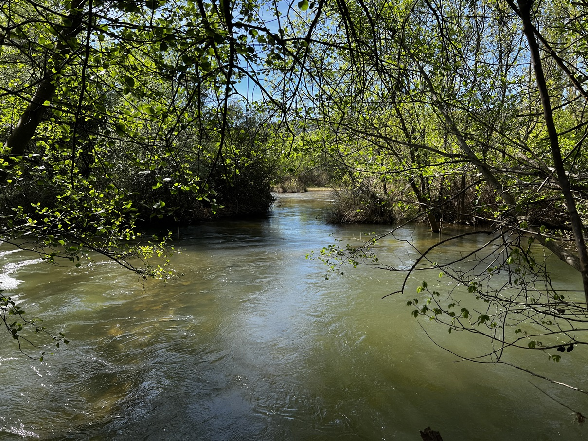
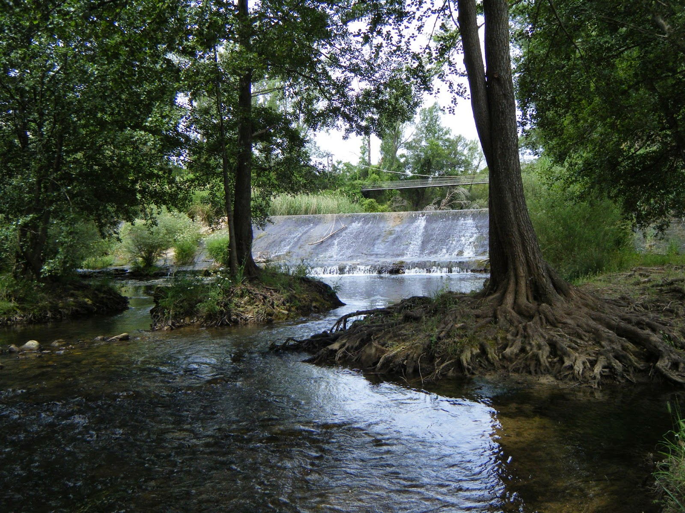

# CHT - Jarama
[:earth_americas: *Seguridad y seguimiento - Mapa de Garmin InReach* :earth_americas:](https://share.garmin.com/gpalacios82)

## Índice
* [S6 - Río Jarama en Uceda](./CHT-Jarama.md#río-jarama-en-uceda-s6)
* [S7 - Río Jarama en Torremocha](./CHT-Jarama.md#río-jarama-en-torremocha-s7)
* [S9 - Río Jarama de Valdetorres a Santo Domingo](./CHT-Jarama.md#río-jarama-de-valdetorres-a-santo-domingo-s9)
* [Río Jarama PR Sureste](./CHT-Jarama.md#río-jarama-pr-sureste)

## Río Jarama en Uceda S6

**Datos Generales:**
* **Cuenca:** CHT
* **Río:** Jarama
* **Sector:** 6
* **Dificultad:** G-II(2+)
* **Fuente:** Libro SUP - Embalses y ríos (p 488)
* **Estación y Caudal:** [AR16 - Jarama en Valdepeñas: 12-20m3 (altura entre 0,8-1,3m)](https://saihtajo.chtajo.es/stmobile/index.php?url=/tr/ficha/estacion:AR16)
* **Tiempo total (aprox):** 4:00

>**Observaciones:**
Complicadas las salidas, son muy puntuales. Además, es una zona muy verde, y desde la fecha de edición del libro, la rivera del río ha ido ganando frondosidad. Observé dos puntos intermedios en el río, y además de mucha velocidad (15m3) habia zonas muy estrechas y con muchas ramas. Eso facilita la posibilidad de quedarse enganchado, y se dificulta la posibilidad de escape intermedio. Totalmente descartado remontar el río con ese caudal.

**Exploraciones**
* **20240411**: *Se ha procedido a explorar el río con 10m3s y hay demasiada vegetación para tanta corriente, hay alto riesgo de quedarse atrapado entre ramas, el río lleva velocidad y dificulta lo toma de contras*
* **20240711**: *Se ha vuelto a explorar con 3m3, va justo, pero se puede hacer, aun así, creo que hay bastante vegetación. La conclusión ha sido que se puede hacer con 5m3 aprox, y con un buen machete (por si acaso) para abrirse paso entre la vegetación, para posibles obstaculos*

[Mapa con las fotos trackeadas de las exploraciones](https://www.google.com/maps/d/u/0/edit?mid=1-Y43CBV7DBhx_eSraqZ1HhEpB9GOAE4&usp=sharing)

<table>
    <tr>
        <td colspan=2><b>Puente al lado de la Playa del Jarama</b></td>
    </tr>
    <tr>
        <td><strong>3m3</strong> de agua</td>
        <td><strong>10m3</strong> de agua</td>
    </tr>
    <tr>
        <td></td>
        <td></td>
    </tr>
    <tr>
        <td></td>
        <td></td>
    </tr>
</table>

<table>
    <tr>
        <td colspan=2>Otro punto del recorrido, más abajo, tambien  <b>con 10m3</b></td>
    </tr>
    <tr>
        <td></td>
        <td></td>
    </tr>
</table>

**Tabla de riesgos**
| Peligro | Evacuación | Suma | Categorización |
|---------|------------|------|----------------|
|     2   |       2    |   4  |      Alto      |

**Waypoints:**
* **PID :arrow_lower_right::** [40.870586,-3.451925](https://maps.app.goo.gl/NYryL6f8RY85Gvvd8) :car: [Waze a PID](https://waze.com/?ll=40.870586,-3.451925&navigate=yes)
* **PSC :arrow_upper_right::** [40.844982,-3.470688](https://maps.app.goo.gl/ExHsKKNre9HN4KVS6) :car: [Waze a PSC](https://waze.com/?ll=40.844982,-3.470688&navigate=yes)

**Tracks:**
* [Track Raft - 5,5 Km](https://connect.garmin.com/modern/course/192904137)
* [Track Walk - 4 Km](https://connect.garmin.com/modern/course/192902293)

**Historial**
* N/A

## Río Jarama en Torremocha S7

**Datos Generales:**
* **Cuenca:** CHT
* **Río:** Jarama
* **Sector:** 7
* **Dificultad:** G-II(2+)
* **Fuente:** Libro SUP - Embalses y ríos (p 492)
* **Estación y Caudal:** [AR16 - Jarama en Valdepeñas: 12-20m3 (altura entre 0,8-1,3m)](https://saihtajo.chtajo.es/stmobile/index.php?url=/tr/ficha/estacion:AR16)
* **Tiempo total (aprox):** 6:00

>**Observaciones:**
>*Se puede hacer todo el año, pero la mejor época es noviembre-mayo por haber más caudal por las lluvias.*
>
>*La primera mitad del recorrido, el río está encañonado en el MI y con mucha vegetación y campos de cultivo en el MD. En este primer tramo hay varios rápidos y trenes de olas pequeños.*
>
>*A partir de la curva de Caraquiz, hay varias **pozas con drosajes***

Punto de embarque, por debajo de la *Presilla de Uceda*, MD:

**Tabla de riesgos**
| Peligro | Evacuación | Suma | Categorización |
|---------|------------|------|----------------|
|     2   |       2    |   4  |      Alto      |

**Waypoints:**
* **PID :arrow_lower_right::** [40.844935,-3.470037](https://maps.app.goo.gl/aQjphbYd5sHTU4Kx8) :car: [Waze a PID](https://waze.com/?ll=40.844935,-3.470037&navigate=yes)
* **PSC :arrow_upper_right::** [40.772147,-3.516891](https://maps.app.goo.gl/XN4uFr8zu7eCDtfc9) :car: [Waze a PSC](https://waze.com/?ll=40.772147,-3.516891&navigate=yes)

**Tracks:**
* [Track Raft - 11,5 Km](https://connect.garmin.com/modern/course/314510299)
* [Track Walk - 12,5 Km](https://connect.garmin.com/modern/course/314509606)

**Historial**
* N/A

## Río Jarama de Valdetorres a Santo Domingo S9

**Datos Generales:**
* **Cuenca:** CHT
* **Río:** Jarama
* **Sector:** 9
* **Dificultad:** G-II
* **Estación y Caudal:** [AR16 - Jarama en Valdepeñas: 10-18m3 (altura entre 0,6-1,2m máx 2m)](https://saihtajo.chtajo.es/stmobile/index.php?url=/tr/ficha/estacion:AR16)
* **Fuente:** Libro SUP - Embalses y ríos (p 498)
* **Tiempo total (aprox):** 6:00

>**Observaciones:**
*Pendiente de inspección visual, pero me abruma la vegetación...*

**Tabla de riesgos**
| Peligro | Evacuación | Suma | Categorización |
|---------|------------|------|----------------|
|    x    |     x      |   x  |   Pendiente    |

**Waypoints:**
* **PID :arrow_lower_right::** [40.701647,-3.536752](https://maps.app.goo.gl/5Q71SzBuRXM7xdH76) :car: [Waze a PID](https://waze.com/?ll=40.701647,-3.536752&navigate=yes)
* **PSC :arrow_upper_right::** [40.637167,-3.561681](https://maps.app.goo.gl/nW6hDeiUTeWGyfxz8) :car: [Waze a PSC](https://waze.com/?ll=40.637167,-3.561681&navigate=yes)

**Tracks:**
* [Track Raft - 9,5 Km](https://connect.garmin.com/modern/course/261821481)
* [Track Walk - 9 Km](https://connect.garmin.com/modern/course/261820407)

**Historial**
* N/A

## Río Jarama PR Sureste

**Datos Generales:**
* **Cuenca:** CHT
* **Río:** Jarama
* **Sector:** PR Sureste
* **Dificultad:** G-II(2+)
* **Estaciones y Caudales:**
    * [AR18 - Manzanares en Rivas Vaciamadrid](https://saihtajo.chtajo.es/stmobile/index.php?url=/tr/ficha/estacion:AR18)
    * [AR17 - Jarama en Mejorada](https://saihtajo.chtajo.es/stmobile/index.php?url=/tr/ficha/estacion:AR17)
* **Fuente:** [Wikiloc - Cejus](https://es.wikiloc.com/rutas-kayac/kayak-lineal-rio-jarama-70996155)
* **Tiempo total (aprox):** 6:30

>**Observaciones:**
*Tramo con abundante vegetación en las orillas y presencia de  mal olor (recomendado usar Vicks Vaporub o tapones nasales "Nosa").  Caudal óptimo para la navegación entre 4-10 m3/s.  Es fundamental realizar una inspección previa del río,  en especial los puntos de acceso y salida,  así como los rápidos clase II/III que presenta.  Prestar atención a posibles obstáculos como árboles caídos y ramas. Recordar que el Jarama, en este tramo,  recibe aguas residuales,  por lo que se desaconseja el baño.*

**Tabla de riesgos**
| Peligro | Evacuación | Suma | Categorización |
|---------|------------|------|----------------|
|    1    |     2      |   3  |   Medio    |

**Waypoints:**
* **PID :arrow_lower_right::** [40.419854,-3.501089](https://maps.app.goo.gl/9v4pMTBDjEME6vmm8) :car: [Waze a PID](https://waze.com/?ll=40.419854,-3.501089&navigate=yes)
* **PSC :arrow_upper_right::** [40.334706,-3.470097](https://maps.app.goo.gl/W6uDAxGPCmXoV9u96) :car: [Waze a PSC](https://waze.com/?ll=40.334706,-3.470097&navigate=yes)

**Tracks:**
* [Track Raft - 15 Km](https://connect.garmin.com/modern/course/261825044)
* [Track Walk - 12 Km](https://connect.garmin.com/modern/course/261825165)

**Historial**
* N/A

## Aviso importante
>*La información de este sitio sobre secciones de aguas bravas se basa en las experiencias y valoraciones de este sitio web. No pretende ser una guía profesional ni una recomendación absoluta. **El usuario es el único responsable de conocer sus limitaciones y evaluar los riesgos** antes de realizar cualquier actividad en el río. Las condiciones del río cambian constantemente y la información aquí podría no ser completamente precisa en el momento de su viaje. **Considere este sitio como un registro personal, no como una guía general de navegación en aguas bravas**. Este sitio queda exento de cualquier responsabilidad por daños o lesiones derivados del uso de esta información. Siempre consulte con guías profesionales y tome todas las medidas de seguridad necesarias antes de adentrarse en el río.*
