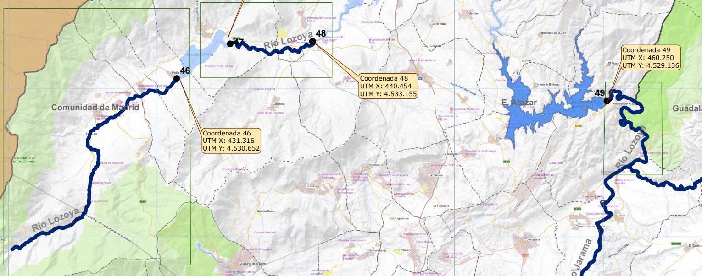
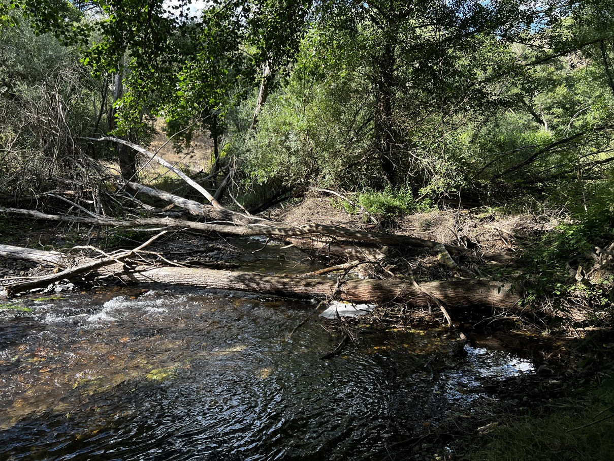
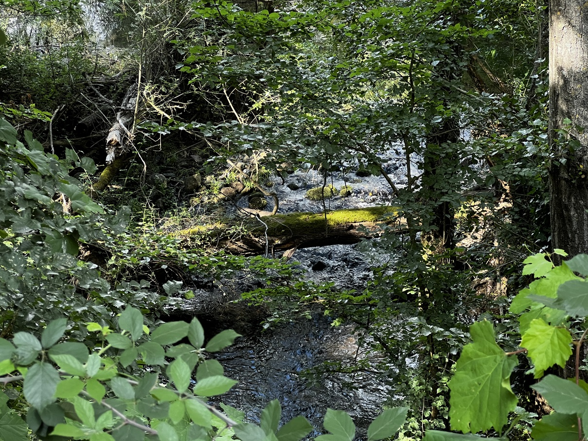
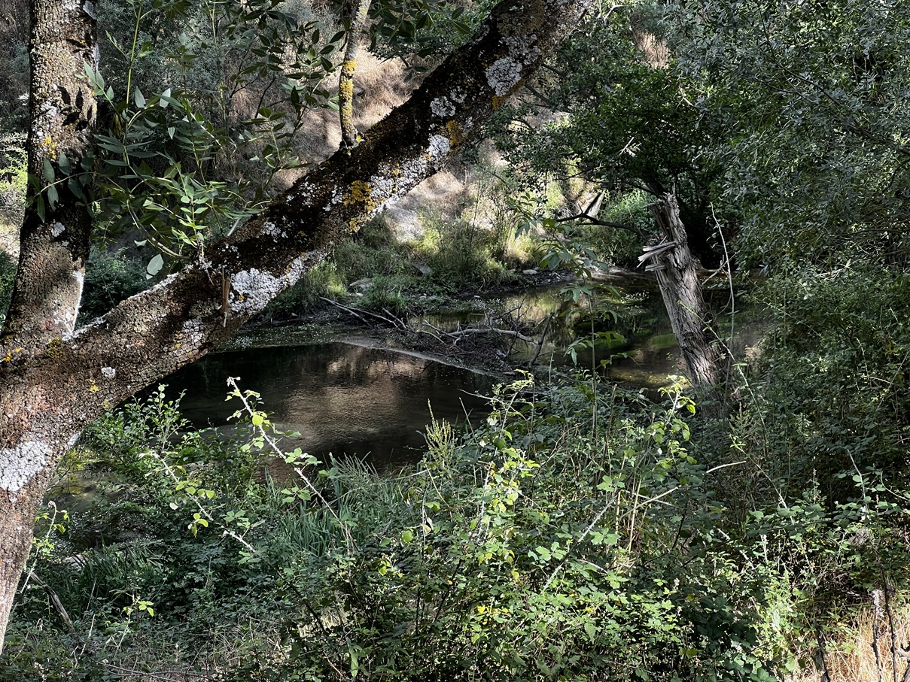
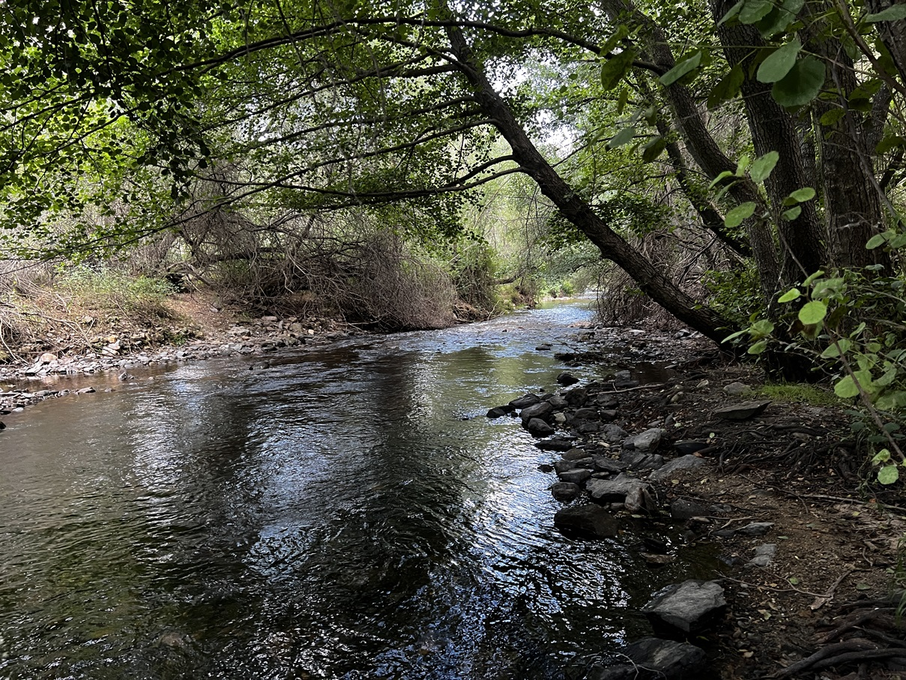
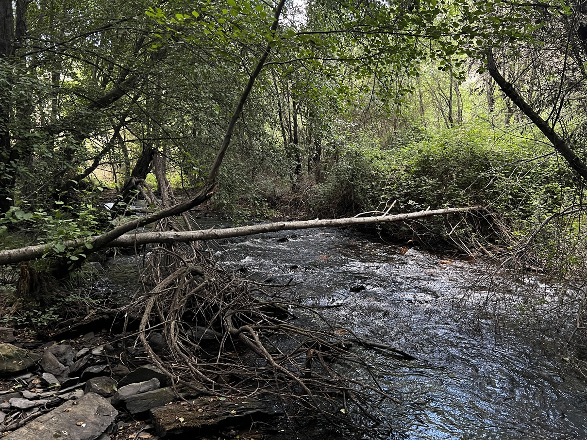

# CHT - Lozoya
[:earth_americas: *Seguridad y seguimiento - Mapa de Garmin InReach* :earth_americas:](https://share.garmin.com/gpalacios82)

## Índice
* S4 - Lozoya en Riosequillo - Ya no es legal navegar en este tramo
* S5 - Lozoya en Buitrago - Ya no es legal navegar en este tramo
* [S6 - Lozoya en el Atazar](./CHT-Lozoya.md#río-lozoya-en-el-atazar-s6)

## Río Lozoya en el Atazar S6

**Datos Generales:**
* **Cuenca:** CHT
* **Río:** Lozoya
* **Sector:** 6
* **Dificultad:** G-II(3)
* **Estación y Caudal:** *No encontrado*
* **Fuente:** Libro SUP - Embalses y ríos (p 544)
* **Tiempo total (aprox):** 5:00

>**Observaciones:**
*No he encontrado ningún sitio en internet donde se muestre el aforo del río. Ni hay estaciones en el río, ni el embalse del Atazar informa del agua circundante de salida, ni de entrada en el Pontón de la Oliva, ni tampoco en el Azud de La Parra, por lo que aunque hay sueltas continuas desde el Atazar, habrá que tener cuidado con las posibles subidas de agua

Por otro lado, hay mucha vegetación y árboles caidos en todo el curso del río. Con poco agua se puede hacer y es más fácil, aunque corremos el riesgo de que no se pueda meter bien la pala. Con mucho agua, a pesar de que hay poco desnivel, el rio puede alcanzar grandes velocidades, y en algunos tramos el río puede convertirse en una trampa mortal, por haber un tramo lleno de zarzas y ramas sin salida.*

<table>
    <tr>
        <td colspan=3>Varias fotos a lo largo del recorrido con poco agua, muy justo para navegar (tomadas el 11/07/24)</td>
    <tr>
        <td></td>
        <td></td>
        <td></td>
    </tr>
    <tr>
        <td></td>
        <td></td>
        <td></td>
    </tr>
</table>

**Tabla de riesgos**
| Peligro | Evacuación | Suma | Categorización |
|---------|------------|------|----------------|
|    2    |     2      |   4  |   Alto    |

**Waypoints:**
* **PID :arrow_lower_right::** [40.912883,-3.451326](https://maps.app.goo.gl/ZBQfK9zXSVHmMR3e8) :car: [Waze a PID](https://waze.com/?ll=40.912883,-3.451326&navigate=yes)
* **PSC :arrow_upper_right::** [40.883695,-3.442521](https://maps.app.goo.gl/PNo1EmDpAYhxYKqg8) :car: [Waze a PSC](https://waze.com/?ll=40.883695,-3.442521&navigate=yes)

**Tracks:**
* [Track Raft - 7,5 Km](https://connect.garmin.com/modern/course/286535876)
* [Track Walk - 7,5 Km](https://connect.garmin.com/modern/course/286535212)

**Historial**
* N/A

## Aviso importante
>*La información de este sitio sobre secciones de aguas bravas se basa en las experiencias y valoraciones de este sitio web. No pretende ser una guía profesional ni una recomendación absoluta. **El usuario es el único responsable de conocer sus limitaciones y evaluar los riesgos** antes de realizar cualquier actividad en el río. Las condiciones del río cambian constantemente y la información aquí podría no ser completamente precisa en el momento de su viaje. **Considere este sitio como un registro personal, no como una guía general de navegación en aguas bravas**. Este sitio queda exento de cualquier responsabilidad por daños o lesiones derivados del uso de esta información. Siempre consulte con guías profesionales y tome todas las medidas de seguridad necesarias antes de adentrarse en el río.*