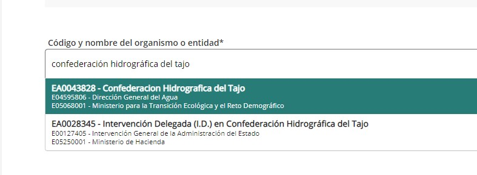

## CHT - Solicitud de permiso de navegación responsable

### Descarga del Formulario

Desde la web de la [CHT](https://www.chtajo.es/Servicios/Tramitaciones/Paginas/procedimientos/navegacion.aspx) podemos acceder y descargar el [formulario de navegación responsable](https://www.chtajo.es/Servicios/Tramitaciones/Documents/Declara_Resp/DR_Impreso_Completo.pdf)

Se rellena con nuestros datos y la de nuestra embarcación, y se guarda o imprime en PDF. Si tuvieramos matrícula de años anteriores, hay que rellenarla. Hay que firmarlo 2 veces, en la parte de las embarcaciones, y la parte de autorización RGPD

### Presentación del Formulario

Una vez con el PDF Firmado y relleno, vamos al [Registro Electrónico](https://www.chtajo.es/Servicios/Tramitaciones/Paginas/procedimientos/accesoREC.aspx) y lo presentamos a través de un certificado digital o clave PIN

Importante seleccionar el destinatario, en este caso


Y luego rellenar:

**Asunto:**
```
Solicitud de Permiso de Navegación Responsable
```

**Lo que expongo:**
```
Por la presente, manifiesto mi interés en realizar actividades de navegación y flotación en el ámbito de la Confederación Hidrográfica del Tajo (CHT).
Declaro bajo mi responsabilidad que cumplo con todos los requisitos establecidos en la normativa vigente para el ejercicio de la navegación en la cuenca del Tajo, y que dispongo de la documentación que así lo acredita.
```

**Lo que solicito:**
```
En virtud de lo expuesto, solicito la correspondiente Declaración Responsable para el ejercicio de la navegación y flotación, comprometiéndome a cumplir con las obligaciones y requisitos establecidos en la normativa aplicable.
Acompaño a la presente solicitud el formulario de navegación responsable cumplimentado
Agradezco la atención prestada a mi solicitud.
```

Cargamos el pdf firmado

Y una vez enviado nos descargamos y guardamos el justificante, ya que si no nos contestan en el plazo máximo de 3 meses de resolución, le podremos reclamar mediante email la carta de pago.

### Consultar estado

Desde el [Registro Electrónico](https://www.chtajo.es/Servicios/Tramitaciones/Paginas/procedimientos/accesoREC.aspx), nos logueamos con el Certificado digital, o bien con la clave PIN, y vamos a [Mis Registros](https://reg.redsara.es/list). Desde ahí vemos las solicitudes pendientes, y el estado.

### Reclamación de Carta de Pago

**Asunto:**
```
Permiso de navegación responsable - Registro inicial XXXXXXX
```

**Para:** [Info Tajo <informacion@chtajo.es>](informacion@chtajo.es)

**Cuerpo:** 
```
Buenos días,

El XXXXXXX de XXXXXXX solicité permiso de navegación para el año XXXXXXX para un Kayak, pero no tengo respuesta. 

La referencia del registro inicial es: XXXXXXX 

Mi nombre: XXXXXXX XXXXXXX XXXXXXX
DNI: XXXXXXX 

¿Me podéis confirmar si hubo algún problema? 

Gracias por todo y un saludo
Gustavo
```