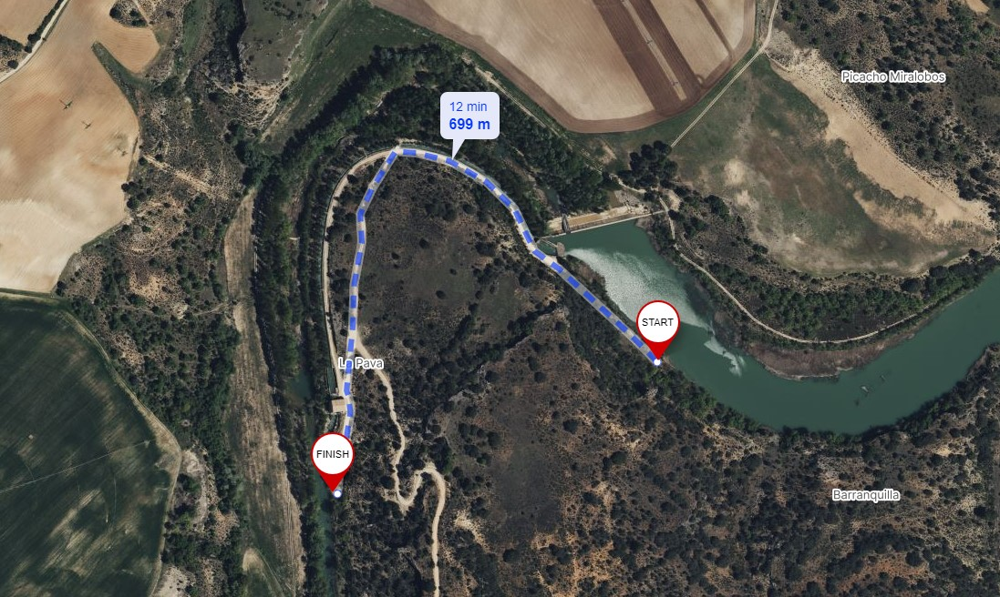

# CHT - Tajo
[:earth_americas: *Seguridad y seguimiento - Mapa de Garmin InReach* :earth_americas:](https://share.garmin.com/gpalacios82)

## Río Tajo en Peralejos de las Truchas S1 y S2 :heavy_check_mark:

**Datos Generales:**
* **Cuenca:** CHT
* **Río:** Tajo
* **Sector:** 1 y 2
* **Dificultad:** G-III(3+)
* **Estaciones y Caudales:**
    * [AR52 - La Rocha: 10-20m3](https://saihtajo.chtajo.es/stmobile/index.php?url=/tr/ficha/estacion:AR02)
    * [AR03 - Trillo: 25-45m3](https://saihtajo.chtajo.es/stmobile/index.php?url=/tr/ficha/estacion:AR03)
* **Fuente:** Libro SUP - Embalses y ríos (p 578)
* **Tiempo total (aprox):** 12:00

>**Observaciones:**
*Es un río radicalmente distinto. En verano con un caudal de escasos 25m3 (en Trillo) es un tramo donde se hacen excursiones con niños y kayak auto-vaciables*

**Tabla de riesgos**
| Peligro | Evacuación | Suma | Categorización |
|---------|------------|------|----------------|
|     2   |       2    |   4  |      Alto      |

**Waypoints:**
* **PID :arrow_lower_right::** [40.649787,-1.980716](https://maps.app.goo.gl/CtLjpEqyyVF13hSc6) :car: [Waze a PID](https://waze.com/?ll=40.649787,-1.980716&navigate=yes)
* **PSC :arrow_upper_right::** [40.708971,-2.066079](https://maps.app.goo.gl/ZXxJWzcsDVDtYTmu9) :car: [Waze a PSC](https://waze.com/?ll=40.708971,-2.066079&navigate=yes)

**Tracks:**
* [Track Raft - 14 Km](https://connect.garmin.com/modern/course/188402902)
* [Track Walk - 14 Km](https://connect.garmin.com/modern/course/188400896)

**Historial**
* [20220819 - 25m3/s (en Trillo)](https://connect.garmin.com/modern/activity/9435744089)

## Río Tajo en Puente de Murel S6

**Datos Generales:**
* **Cuenca:** CHT
* **Río:** Tajo
* **Sector:** 6
* **Dificultad:** G-I(II)
* **Estaciones y Caudales:**
    * [AR52 - La Rocha: 10-20m3](https://saihtajo.chtajo.es/stmobile/index.php?url=/tr/ficha/estacion:AR02)
    * [AR03 - Trillo: 25-45m3](https://saihtajo.chtajo.es/stmobile/index.php?url=/tr/ficha/estacion:AR03)
* **Fuente:** Libro SUP - Embalses y ríos (p 598)
* **Tiempo total (aprox):** 9:00

>**Observaciones:**
*Los primeros kms hasta la presa discurren con algunos tramos de aguas rápidas de clase II. Ojo en la presa, que hay que sortearla por la izquierda*

**Tabla de riesgos**
| Peligro | Evacuación | Suma | Categorización |
|---------|------------|------|----------------|
|    1    |     2      |   3  |   Medio    |

**Waypoints:**
* **PID :arrow_lower_right::** [40.703229,-2.495974](https://maps.app.goo.gl/LE5Z6B4XNwJierMa9) :car: [Waze a PID](https://waze.com/?ll=40.703229,-2.495974&navigate=yes)
* **PSC :arrow_upper_right::** [40.696245,-2.601157](https://maps.app.goo.gl/7GL16EeyVju95tyK9) :car: [Waze a PSC](https://waze.com/?ll=40.696245,-2.601157&navigate=yes)

**Tracks:**
* [Track Raft - 14 Km](https://connect.garmin.com/modern/course/261693999)
* [Track Walk - 12 Km](https://connect.garmin.com/modern/course/261693206)

**Historial**
* N/A

## Río Tajo en CN Trillo S7

**Datos Generales:**
* **Cuenca:** CHT
* **Río:** Tajo
* **Sector:** 7
* **Dificultad:** G-I/II
* **Estaciones y Caudales:**
    * [AR52 - La Rocha: 10-20m3](https://saihtajo.chtajo.es/stmobile/index.php?url=/tr/ficha/estacion:AR02)
    * [AR03 - Trillo: 25-45m3](https://saihtajo.chtajo.es/stmobile/index.php?url=/tr/ficha/estacion:AR03)
* **Fuente:** Libro SUP - Embalses y ríos (p 600)
* **Tiempo total (aprox):** 10:00

>**Observaciones:**
*El primer tramo tiene algún rápido que agiliza el descenso (los primeros 4-6 km), luego es un paseo tranquilo de remar y remar. Hay mucha vegetación a ambas orillas*

**Tabla de riesgos**
| Peligro | Evacuación | Suma | Categorización |
|---------|------------|------|----------------|
|    0    |     3      |   3  |   Medio    |

**Waypoints:**
* **PID :arrow_lower_right::** [40.691090,-2.610682](https://maps.app.goo.gl/X3GGjtTS8nwsBnjN9) :car: [Waze a PID](https://waze.com/?ll=40.691090,-2.610682&navigate=yes)
* **PSC :arrow_upper_right::** [40.667652,-2.668673](https://maps.app.goo.gl/i3drB8qapuY7XHKv7) :car: [Waze a PSC](https://waze.com/?ll=40.667652,-2.668673&navigate=yes)

**Tracks:**
* [Track Raft - 21 Km](https://connect.garmin.com/modern/course/261691508)
* [Track Walk - 15 Km](https://connect.garmin.com/modern/course/260863842)

**Historial**
* N/A

## Río Tajo en CN José Cabrera-Zorita S8

**Datos Generales:**
* **Cuenca:** CHT
* **Río:** Tajo
* **Sector:** 8
* **Dificultad:** G-I/II
* **Dificultad alternativo:** G-I
* **Estaciones y Caudales:**
    * [AR52 - La Rocha: 10-20m3](https://saihtajo.chtajo.es/stmobile/index.php?url=/tr/ficha/estacion:AR02)
    * [AR03 - Trillo: 25-45m3](https://saihtajo.chtajo.es/stmobile/index.php?url=/tr/ficha/estacion:AR03)
* **Fuente:** Libro SUP - Embalses y ríos (p 604)
* **Tiempo total (aprox):** 7:30 (alternativo)

>**Observaciones:**
*Los primeros 4 kms están muy tupidos de vegetación. Se puede empezar a partir del Km 4 (PID y Tracks alternativos). **Si se decide hacer recorrido completo, hay que comprobar los primeros 4 kms, ya que el paso por el cauce puede estar cortado**.*

**Tabla de riesgos**
| Peligro | Evacuación | Suma | Categorización |
|---------|------------|------|----------------|
|    x    |     x      |   x  |   Pendiente    |

**Waypoints:**
* **PID :arrow_lower_right::** [40.355583,-2.902907](https://maps.app.goo.gl/oQF7mw9VoYUdLVuY7) :car: [Waze a PID](https://waze.com/?ll=40.355583,-2.902907&navigate=yes)
* **PID alternativo :arrow_lower_right::** [40.338377,-2.899121](https://maps.app.goo.gl/TL521Q8unZtgF9pL7) :car: [Waze a PSC alt](https://waze.com/?ll=40.338377,-2.899121&navigate=yes)
* **PSC :arrow_upper_right::** [40.286657,-2.937845](https://maps.app.goo.gl/3aZ871KVPiroTVmG8) :car: [Waze a PSC](https://waze.com/?ll=40.286657,-2.937845&navigate=yes)

**Tracks:**
* [Track Raft - 15 Km](https://connect.garmin.com/modern/course/261686636)
* [Track Walk - 13 Km](https://connect.garmin.com/modern/course/261685815)

**Tracks Alternativos:**
* [Track Raft - 11,5 Km](https://connect.garmin.com/modern/course/261689911)
* [Track Walk - 10 Km](https://connect.garmin.com/modern/course/261689446)

**Historial**
* N/A

## Río Tajo en Almoguera S9 :heavy_check_mark:

**Datos Generales:**
* **Cuenca:** CHT
* **Río:** Tajo
* **Sector:** 9
* **Dificultad:** G-I(3)
* **Estación y Caudal:** [AR08 - Tajo en Almoguera: Todo el año, recomendable 10-22m3](https://saihtajo.chtajo.es/stmobile/index.php?url=/tr/ficha/estacion:AR08)
* **Fuente:** Libro SUP - Embalses y ríos (p 606)
* **Tiempo total (aprox):** 7:30

>**Observaciones:**
*Nada más empezar hay un paso 3, se puede ver y observar desde el emmbarque y así evaluar riesgos e incluso evitarle. A 500m está la ola de Almoguera, que entre 10 y 20m3 se forma. Por debajo y por encima, no se llega a formar la ola. Más abajo nos encontramos con la Piscifactoría de Illana, que tiene un Azud que podemos cruzar sin problemas. Mejor por el márgen derecho, ya que hay menos vegetación. No obstante con 10m3 la altura del río llega por los tobillos en ese tramo. El resto sucede sin problemas, es clase I*

**Tabla de riesgos**
| Peligro | Evacuación | Suma | Categorización |
|---------|------------|------|----------------|
|    1    |     1      |   2  |   Bajo    |

**Waypoints:**
* **PID :arrow_lower_right::** [40.265445,-2.967324](https://maps.app.goo.gl/42WFqvDiRspDeJGP8) :car: [Waze a PID](https://waze.com/?ll=40.265445,-2.967324&navigate=yes)
* **PSC :arrow_upper_right::** [40.207728,-2.999645](https://maps.app.goo.gl/sKgPSA1KogRraM4FA) :car: [Waze a PSC](https://waze.com/?ll=40.207728,-2.999645&navigate=yes)

**Tracks:**
* [Track Raft - 10 Km](https://connect.garmin.com/modern/course/260875268)
* [Track Walk - 11 Km](https://connect.garmin.com/modern/course/260870419)

**Historial**
* [20240414 - 10,5m3/s](https://connect.garmin.com/modern/activity/14893553432/3)

## Río Tajo en Aranjuez S11 :heavy_check_mark:

**Datos Generales:**
* **Cuenca:** CHT
* **Río:** Tajo
* **Sector:** 11
* **Dificultad:** G-I/II
* **Estación y Caudal:** [AR56 - Tajo en Embocador: 8-12m3](https://saihtajo.chtajo.es/stmobile/index.php?url=/tr/ficha/estacion:AR56)
* **Fuente:** Libro SUP - Embalses y ríos (p 610)
* **Tiempo total (aprox):** 4:30

>**Observaciones:**
*La zona del Embocador está imposible de embarcar, hay que hacerlo desde la playa que está más abajo. El primer tramo tiene algo de corriente, pero en general es muy ancho y tranquilo. En el último tramo sí o sí toca palear*

**Tabla de riesgos**
| Peligro | Evacuación | Suma | Categorización |
|---------|------------|------|----------------|
|     0   |       2    |   2  |      Bajo      |

**Waypoints:**
* **PID :arrow_lower_right::** [40.043166,-3.554807](https://maps.app.goo.gl/XmdJq9Q4n8FmUYTe9) :car: [Waze a PID](https://waze.com/?ll=40.043166,-3.554807&navigate=yes)
* **PSC :arrow_upper_right::** [40.040585,-3.604626](https://maps.app.goo.gl/X2XSDdWAZEU7fe3Z9) :car: [Waze a PSC](https://waze.com/?ll=40.040585,-3.604626&navigate=yes)

**Tracks:**
* [Track Raft - 8 Km](https://connect.garmin.com/modern/course/113898968)
* [Track Walk - 5 Km](https://connect.garmin.com/modern/course/259947726)

**Historial**
* [20221009 - 7,71m3/s](https://connect.garmin.com/modern/activity/9756696416)

>**Aviso importante**
*La información de este sitio sobre secciones de aguas bravas se basa en las experiencias y valoraciones de este sitio web. No pretende ser una guía profesional ni una recomendación absoluta. **El usuario es el único responsable de conocer sus limitaciones y evaluar los riesgos** antes de realizar cualquier actividad en el río. Las condiciones del río cambian constantemente y la información aquí podría no ser completamente precisa en el momento de su viaje. **Considere este sitio como un registro personal, no como una guía general de navegación en aguas bravas**. Este sitio queda exento de cualquier responsabilidad por daños o lesiones derivados del uso de esta información. Siempre consulte con guías profesionales y tome todas las medidas de seguridad necesarias antes de adentrarse en el río.*