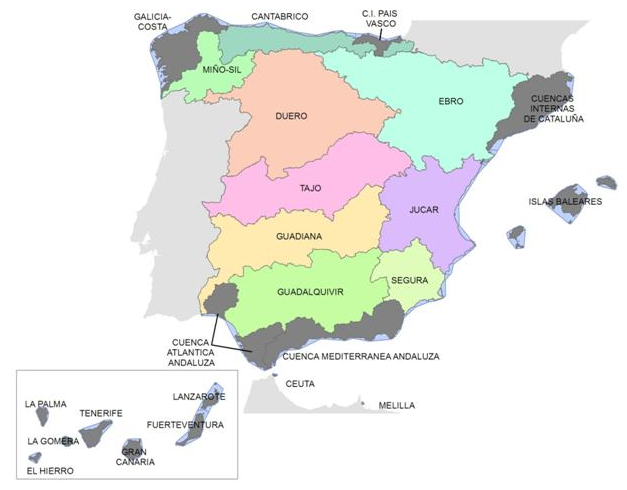

# River 101

[:earth_americas: *Seguridad y seguimiento - Mapa de Garmin InReach* :earth_americas:](https://share.garmin.com/gpalacios82)

## Aviso importante
>*La información de este sitio sobre secciones de aguas bravas se basa en las experiencias y valoraciones de este sitio web. No pretende ser una guía profesional ni una recomendación absoluta. **El usuario es el único responsable de conocer sus limitaciones y evaluar los riesgos** antes de realizar cualquier actividad en el río. Las condiciones del río cambian constantemente y la información aquí podría no ser completamente precisa en el momento de su viaje. **Considere este sitio como un registro personal, no como una guía general de navegación en aguas bravas**. Este sitio queda exento de cualquier responsabilidad por daños o lesiones derivados del uso de esta información. Siempre consulte con guías profesionales y tome todas las medidas de seguridad necesarias antes de adentrarse en el río.*

## Índice

* [Cuenca hidrográfica del Cantábrico](./CHC/)
* [Cuenca hidrográfica del Duero](./CHD/)
* [Cuenca hidrográfica del Ebro](./CHE/)
* [Cuenca hidrográfica del Júcar](./CHJ/)
* [Cuenca hidrográfica del Tajo](./CHT/)

**En todos los casos, es necesario disponer de un permiso de navegación responsable**. Es probable que si tu embarcación mida menos de 2,5m de eslora, se considere (en algunas cuencas hidrográficas) un artículo de baño. Aún así, te recomiendo informarte. En caso que lo necesites, se solicita mediante [este procedimiento](./misc/Permisos%20de%20Navegación.md)

## Leyenda de Análisis de Riesgos
* **Peligro:** *(ramas, árboles caidos, zonas de enganche)*
    * *de 0 (sin peligro)*
    * *a 3 (no hay línea)*
* **Evacuación:** *(posibilidad de salidas a mitad de actividad)*
    * *de 0 (se puede salir en cualquier momento)*
    * *a 3 (sin salidas / encañonado)* 
* **Categorización:** *(suma de ambos riesgos)*
    * **0** *Sin riesgo*
    * **1-2** *Bajo*
    * **3** *Medio*
    * **4** *Alto*
    * **5-6** *Crítico*