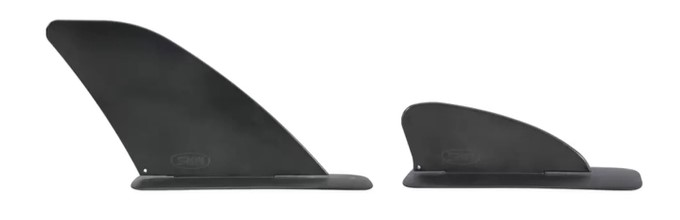

## Modelos en mi mochila
[Packraft Mekong Pablo Whisky Bar](./Embarcaciones.md#packraft-mekong-pablo-whisky-bar)
[Packraft MSR Barracuda R2 PRO](./Embarcaciones.md#packraft-msr-barracuda-r2-pro)

### Packraft Mekong Pablo Whisky Bar
*CHT-43109 / CHE-38531-R / CHC-810-W-001*
* **Marca**: Mekong
* **Modelo**: Pablo Whisky Bar
* **Talla**: L
* **Eslora**: 265 cm
* **Manga**: 90 cm
* **Calado / Puntal**: 10 cm
* **Peso total**: 3,37 kg
* **Carga máxima**: 150 Kg
* **Material**:
    * Tubos: Nylon 210D
    * Suelo: Nylon 840D
    * Cubierta: Nylon 210D

### Packraft MSR Barracuda R2 PRO
*CHT-46562*
* **Marca**: MSR
* **Modelo**: Barracuda R2 PRO
* **Talla**: Única (2 plazas)
* **Eslora**: 360 cm
* **Manga**: 99 cm
* **Calado / Puntal**: 31 cm
* **Peso total**: 5,95 kg
* **Carga máxima**: 230 Kg
* **Material**:
    * Tubos: Nylon 420D / TPU
    * Suelo: Nylon 840D / TPU double
    * Cubierta: Nylon 210D / TPU

Además el Packraft MSR ofrece dos posibilidades de quilla, la pequeña viene de serie, [la grande es un extra](https://www.microrafting.com/products/skeg?variant=40271482192069)

### Packraft MSR Alligator 2S Pro
*Pendiente*
* **Marca**: MSR
* **Modelo**: Alligator 2S Pro
* **Talla**: M
* **Eslora**: 256 cm
* **Manga**: 87 cm
* **Calado / Puntal**: 31 cm
* **Peso total**: 3,36 kg
* **Carga máxima**: 140 Kg
* **Material**:
    * Tubos: Nylon 420D / TPU
    * Suelo: Nylon 840D / TPU double
    * Cubierta: Nylon 210D / TPU

