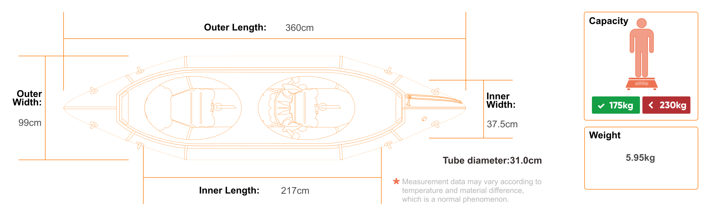
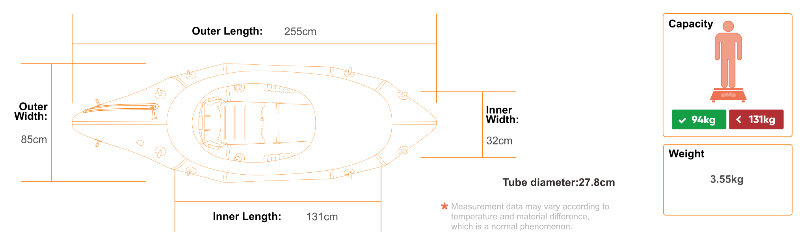

## Modelos en mi mochila
| Embarcación | CHT | CHE | CHD | CHC | Link |
|-------------|-----|-----|-----|-----|------|
| Mekong Pablo Whisky Bar | CHT-43109 | CHE-38531-R | *Pendiente* | CHC-810-W-001 | [Mekong](./Embarcaciones.md#packraft-mekong-pablo-whisky-bar) |
<<<<<<< HEAD
| MRS Barracuda R2 PRO | CHT-46562 | CHE-41245-R | *Pendiente* | CHC-810-W-002 | [Barracuda](./Embarcaciones.md#packraft-MRS-barracuda-r2-pro) |
| MRS Alligator 2S PRO | *En trámite* | CHE-41246-R | *Pendiente* | CHC-810-W-003 | [Alligator](./Embarcaciones.md#packraft-MRS-alligator-2s-pro) |
=======
| MRS Barracuda R2 PRO | CHT-46562 | CHE-41245-R | *Pendiente* | CHC-810-W-002 | [Barracuda](./Embarcaciones.md#packraft-MRS-barracuda-r2-pro) |
| MRS Alligator 2S PRO | *En trámite* | CHE-41246-R | *Pendiente* | CHC-810-W-003 | [Alligator](./Embarcaciones.md#packraft-MRS-alligator-2s-pro) |
>>>>>>> 129a1841ab5aa72c59e9578110b47916df15089c

### Packraft Mekong Pablo Whisky Bar
* **Matrículas**:
    * **CHT-43109** *desde 2022 hasta 2024*
    * **CHE-38531-R** *desde 27-oct 2022 hasta 26-oct-2027*
    * **CHD** *pendiente*
    * **CHC-810-W-001** *desde 1 hasta 30 ago de 2024*
* **Marca**: Mekong
* **Modelo**: Pablo Whisky Bar
* **Talla**: L
* **Eslora**: 265 cm
* **Manga**: 90 cm
* **Calado / Puntal**: 10 cm
* **Peso total**: 3,37 kg
* **Carga máxima**: 150 Kg
* **Material**:
    * Tubos: Nylon 210D
    * Suelo: Nylon 840D
    * Cubierta: Nylon 210D

### Packraft MRS Barracuda R2 PRO
* **Matrículas**:
    * **CHT-46562** *desde 2024 hasta 2024*
    * **CHE-41245-R** *desde 2024 hasta 31 de julio de 2029*
    * **CHD** *pendiente*
    * **CHC-810-W-002** *desde 15 ago hasta 15 sept de 2024*
* **Marca**: MRS
* **Modelo**: Barracuda R2 PRO
* **Talla**: Única (2 plazas)
* **Eslora**: 360 cm
* **Manga**: 99 cm
* **Calado / Puntal**: 31 cm
* **Peso total**: 5,95 kg
* **Carga máxima**: 230 Kg
* **Material**:
    * Tubos: Nylon 420D / TPU
    * Suelo: Nylon 840D / TPU double
    * Cubierta: Nylon 210D / TPU

Además el Packraft MRS Barracuda R2 Pro ofrece dos posibilidades de quilla, la pequeña viene de serie, [la grande es un extra](https://www.microrafting.com/products/skeg?variant=40271482192069)

### Packraft MRS Alligator 2S Pro
* **Matrículas**:
    * **CHT** *en trámite*
    * **CHE-41246-R** *desde 2024 hasta 31 de julio de 2029*
    * **CHD** *pendiente*
    * **CHC-810-W-003** *desde 15 ago hasta 15 sept de 2024*
* **Marca**: MRS
* **Modelo**: Alligator 2S Pro
* **Talla**: M
* **Eslora**: 255 cm
* **Manga**: 85 cm
* **Calado / Puntal**: 31 cm
* **Peso total**: 3,55 kg
* **Carga máxima**: 131 Kg
* **Material**:
    * Tubos: Nylon 420D / TPU
    * Suelo: Nylon 840D / TPU double
    * Cubierta: Nylon 210D / TPU

Además el Packraft MRS Alligator 2S Pro ofrece dos posibilidades de quilla, la pequeña viene de serie, [la grande es un extra](https://www.microrafting.com/products/skeg?variant=40271482192069)

