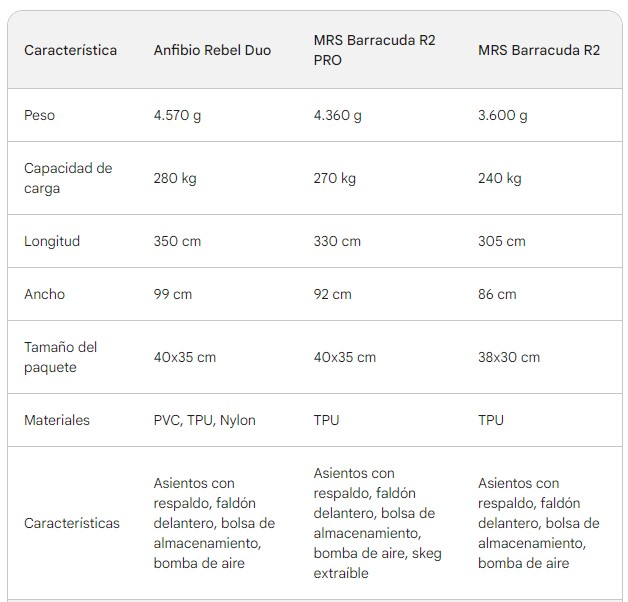

## Packrafts

### MRS Barracuda R2 PRO
El Barracuda R2 Pro es un packraft tándem con un diseño de casco de alto rendimiento, fabricado con tejido resistente y equipado con asientos combinados (para arrodillarse o sentarse) y cubierta de pulverización extraíble para dos personas. Incluye un sistema de almacenamiento interno (ISS). La embarcación puede utilizarse como embarcación abierta o totalmente cerrada.

El Barracuda R2 Pro es para trabajar en equipo. Sobresale en todo lo que sea conseguir un buen rendimiento a dos:
* Remo de larga distancia
* Competiciones de aventura 
* Piragüismo en aguas bravas
* Exploraciones remotas
* Remo recreativo
* Pesca y caza

Flotabilidad: 300 kg
Peso Barco: 5160g
Longitud Exterior: 360cm

2.199,00 € incl. 19% IVA

[Link](https://www.packrafting-store.de/mrs-barracuda-r2-pro_3)

### MRS Barracuda R2
El Barracuda R2 es un packraft tándem con diseño de casco de alto rendimiento que proporciona más velocidad y espacio extra, apreciado por los remeros viajeros y packrafters con preferencia por el rendimiento en el agua. ¡También con Sistema de Almacenamiento Interno (ISS) disponible!

El Barracuda R2 es para parejas y socios. Sobresale en cualquier cosa para conseguir resultados divertidos a dos:

Remo de recreo
Remo de larga distancia
Competiciones de aventura 
Exploraciones remotas
Pesca y caza
El estilo sólo lo marca uno mismo, ya sean exploraciones relajadas u objetivos ambiciosos.

La embarcación se puede utilizar tanto en lagos como en ríos, aguas bravas fáciles y bahías oceánicas resguardadas, pero importa un buen trabajo en equipo y una acción razonable en aguas en movimiento. La posibilidad de transporte en aviones, autocaravanas, trenes y autobuses la convierten en una embarcación de viaje perfecta.

Flotabilidad: 300 kg
Peso Barco: 4260g
Longitud Exterior: 360 cm

1.409,00 € incl. 19% IVA

[Link](https://www.packrafting-store.de/mrs-barracuda-r2_1)

## Qué packraft elegir

De acuerdo a tus necesidades, te recomendaría el **MRS Barracuda R2 PRO** como segundo packraft.

Aquí te explico por qué:

* Peso y tamaño: El Barracuda R2 PRO es el más ligero y compacto de los tres packrafts que estás considerando, lo que lo hace ideal para viajes con otra persona. Es fácil de transportar y almacenar, ya sea en tu mochila o en el maletero de tu coche.
* Rendimiento en aguas bravas: El Barracuda R2 PRO está diseñado para manejar aguas bravas de clase I y II, lo que lo hace adecuado para los ríos que planeas navegar. Su diseño de casco dinámico y su skeg extraíble le proporcionan estabilidad y maniobrabilidad en aguas turbulentas.
* Versatilidad: El Barracuda R2 PRO también es una buena opción para aguas tranquilas y lagos. Su forma estable y su gran capacidad lo hacen ideal para viajes largos y acampar.
* Comodidad: El Barracuda R2 PRO cuenta con asientos con respaldo y un faldón delantero, lo que te proporciona comodidad y protección contra los elementos durante tus viajes.

El **Anfibio Rebel Duo** también es una buena opción, pero es un poco más pesado y voluminoso que el Barracuda R2 PRO. Si no te importa el peso adicional y quieres un packraft con la máxima capacidad de carga, entonces el Rebel Duo podría ser una buena opción para ti.

El **MRS Barracuda R2** es la opción más ligera, pero no es tan resistente como el Rebel Duo o el Barracuda R2 PRO. Si solo planeas usar el packraft en aguas tranquilas y lagos, entonces el Barracuda R2 podría ser una buena opción para ti.

## Accesorios

### Pala TNP Rapa + Funda | 4 partes + Bolsa | 210mm

Esta nueva versión está hecha exclusivamente para nuestra gama de Kayaks Ultraligeros (ULK) y Packrafts. También es la mejor remo de repuesto del mercado, gracias a su ligero sistema de fijación por clip y a su ajuste de alta calidad,
ha sido posible fabricar estos remos con un asa Skypole de 30 mm (mayor rigidez y durabilidad de los montajes con el paso del tiempo, siendo los orificios de fijación perforados en el enchufe forrado con un tejido carbono).

La longitud de 197 cm pesa sólo 940 gramos, y cabe en una bolsa nylon de 58 x 20 cm por 6 cm grosor.
Su fiabilidad ha sido probada y aprobada en aguas bravas e incluso en condiciones de río alto.

Los extremos de los pasadores fibra de vidrio están reforzados con carbono
PAC: Poliamida + 1 hoja de tejido carbono
Longitud remo plegada: 56 cm (197), 58 cm (200), 60 cm (205), 65 cm (215)

199,00 €

[Link](https://www.nootica.es/remo-kayak-tnp-rapa-funda-4-partes-bolsa.html)