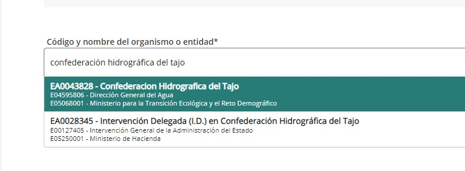

## Solicitud de permiso de navegación responsable


### Descarga del Formulario

* **Para la CHT (hasta 3m: 25€ / a partir de 3m: 40€)**: Desde la web de la [CHT](https://www.chtajo.es/Servicios/Tramitaciones/Paginas/procedimientos/navegacion.aspx) podemos acceder y descargar el [formulario de navegación responsable](https://www.chtajo.es/Servicios/Tramitaciones/Documents/Declara_Resp/DR_Impreso_Completo.pdf)
* **Para la CHC (gratis)**: Desde la web de la [CHC](https://www.chcantabrico.es/servicios/navegacion-y-flotacion) podemos acceder y descargar el [formulario de navegación responsable](https://www.chcantabrico.es/documents/20143/406489/20200508_modelo_declaracion_responsable.pdf/354a99f4-8079-f91e-8421-188a3b759ba3)
* **Para la CHE (gratis)**: Desde la web de la [CHE](https://sede.miteco.gob.es/portal/site/seMITECO/ficha-procedimiento?procedure_suborg_responsable=3&boton=Ver+m%C3%A1s&procedure_id=253&by=theme) podemos acceder y tramitarlo directamente online, sin formularios

Se rellena con nuestros datos y la de nuestra embarcación, y se guarda o imprime en PDF. Si tuvieramos matrícula de años anteriores, hay que rellenarla. Hay que firmarlo 2 veces, en la parte de las embarcaciones, y la parte de autorización RGPD

### Presentación del Formulario

Una vez con el PDF Firmado y relleno, vamos al [Registro Electrónico de la red Sara](https://rec.redsara.es/registro/action/are/acceso.do) y lo presentamos a través de un certificado digital o clave PIN

Importante seleccionar el destinatario, en el ejemplo de la CHT


Y luego rellenar:

**Asunto:**
```
Solicitud de Permiso de Navegación Responsable
```

**Lo que expongo:**
```
Por la presente, manifiesto mi interés en realizar actividades de navegación y flotación en el ámbito de la Confederación Hidrográfica del XXXXXX.
Declaro bajo mi responsabilidad que cumplo con todos los requisitos establecidos en la normativa vigente para el ejercicio de la navegación en la cuenca del XXXXXX, y que dispongo de la documentación que así lo acredita.
```

**Lo que solicito:**
```
En virtud de lo expuesto, solicito la correspondiente Declaración Responsable para el ejercicio de la navegación y flotación, comprometiéndome a cumplir con las obligaciones y requisitos establecidos en la normativa aplicable.
Acompaño a la presente solicitud el formulario de navegación responsable cumplimentado
Agradezco la atención prestada a mi solicitud.
```

Cargamos el pdf firmado

Y una vez enviado nos descargamos y guardamos el justificante, ya que si no nos contestan en el plazo máximo de 3 meses de resolución, le podremos reclamar mediante email la carta de pago.

### Consultar estado

Desde el [Registro Electrónico](https://rec.redsara.es/registro/action/are/acceso.do), nos logueamos con el Certificado digital, o bien con la clave PIN, y vamos a [Mis Registros](https://reg.redsara.es/list). Desde ahí vemos las solicitudes pendientes, y el estado.

### Reclamación de Carta de Pago

De los 4 años que llevo solicitando el permiso de navegación responsable (a fecha 2024):
* En la CHE me han respondido casi al día siguiente con el permiso gratuito por 5 años
* En el CHT, me han respondido directamente 1 vez (a los dos meses), las otras 2 veces lo he tenido que reclamar a los 2/3 meses. He conseguido obtener dicha carta de pago mediante contacto con ellos por Email a: [Info Tajo <informacion@chtajo.es>](mailto:informacion@chtajo.es)

**Asunto:**
```
Permiso de navegación responsable - Registro inicial XXXXXXX
```

**Cuerpo:** 
```
Buenos días,

El XXXXXXX de XXXXXXX solicité permiso de navegación para el año XXXXXXX para un Kayak, pero no tengo respuesta. 

La referencia del registro inicial es: XXXXXXX 

Mi nombre: XXXXXXX XXXXXXX XXXXXXX
DNI: XXXXXXX 

¿Me podéis confirmar si hubo algún problema? 

Gracias por todo y un saludo
Gustavo
```

### Matrículas sí o no
Según la normativa, no queda claro si un packraft hinchable debería o no llevar la matrícula pegada.
Mi pensamiento es... si es una embarcación y debe tener el permiso de navegación responsable, debería tener la matrícula. Ahora bien, en el Mekong tengo permiso para:

* CHT
* CHE
* CHC
* Quiero sacar en 2025 la del CHD

**¿Cómo hacemos para ponerlas todas?**
Bueno o usamos el kayak como si fuera un lienzo de gomets, o ponemos las más significativas (donde más vayamos a navegar)
[Las pegatinas se pueden comprar aquí](https://www.matriculasdebarcos.com/producto/matriculas-confederacion-hidrografica/)
NO obstante, depende de la interpretación de la ley de los responsables (seprona, guardia civil, medio ambiente...) de si te van a multar o no por llevar o no la matrícula